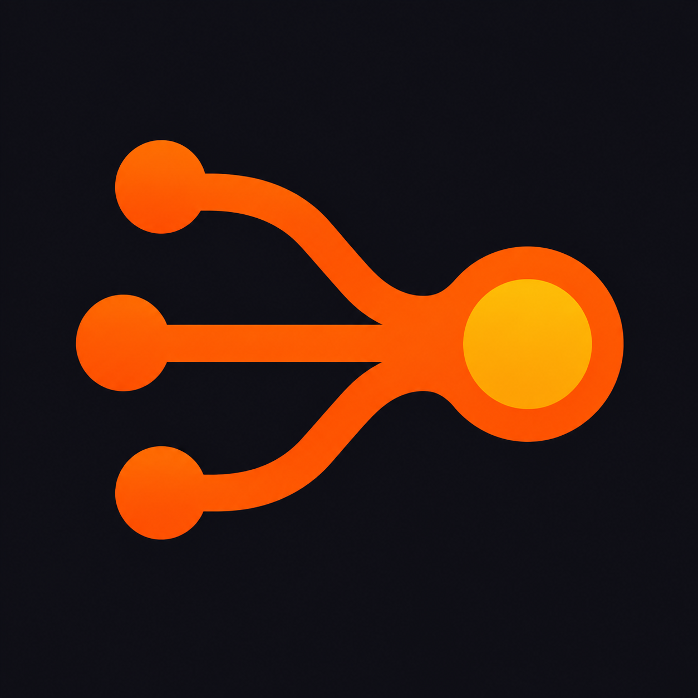

<p align="center">
  
</p>

<h1 align="center">Lawa</h1>

<p align="center">
  <strong>Workflow-оркестратор параллельной работы AI-агентов через Codex App Server.</strong><br>
  Опишите DAG в JSON — Lawa запустит готовые ветки, дождётся зависимостей,
  сохранит состояние и предоставит единый интерфейс наблюдения.
</p>

## Что даёт Lawa

У каждого кубика workflow есть отдельный prompt, thread Codex и файл памяти.
Независимые кубики стартуют параллельно, а зависимые — только после успешного
завершения входов. После сигнала или сбоя run остаётся на диске и продолжается по
тому же ID.

Пользователю не нужно работать с протоколом Codex:

```text
lawa run / resume
        │
        ▼
  фасад Lawa
  ├── процессы codex app-server
  ├── thread и turn
  ├── зависимости и параллельные волны
  ├── meta.json и events.jsonl
  └── status / logs / dashboard
```

Для короткой линейной задачи Lawa обычно не нужна. Она полезна, когда есть
несколько независимых исследований или изменений и отдельный этап сборки результата.

## Единственный runtime: App Server

Lawa запускает официальный `codex app-server --stdio` напрямую. Отдельного
app-native режима, `--mode` и команд второго протокола нет. Один CLI одинаково
работает на личном macOS/Linux и на Linux-сервере. Установленный Codex Desktop не
меняет способ исполнения; нужен доступный и авторизованный Codex CLI.

Lawa сознательно не создаёт нативные задачи Codex Desktop. У Desktop нет публично
документированного программного API, через который внешний Go-процесс мог бы
создавать, продолжать и наблюдать такие задачи. Посредник в виде управляющего
агента добавлял бы модельные запросы, задержку, стоимость и узкое место при
параллельном запуске множества workflow. Поэтому наблюдаемость реализована самой
Lawa, а появление App Server thread в Desktop не гарантируется.

Полное решение и условие его пересмотра описаны в
[исследовании интеграции](docs/codex-integration.md). Основа протокола —
[официальная документация Codex App Server](https://learn.chatgpt.com/docs/app-server).

## Установка

Готовые бинарники поддерживают macOS и Linux на `amd64` и `arm64`.

```sh
curl -fsSL https://github.com/stray-live-pixel/Lawa/releases/latest/download/install.sh | sh
```

Если `curl` отсутствует:

```sh
wget -qO- https://github.com/stray-live-pixel/Lawa/releases/latest/download/install.sh | sh
```

Сначала показать план без изменений:

```sh
curl -fsSL https://github.com/stray-live-pixel/Lawa/releases/latest/download/install.sh |
  sh -s -- --plan
```

По умолчанию устанавливаются:

```text
бинарник: ~/.local/bin/lawa
скилл:    ~/.codex/skills/lawa/SKILL.md
```

Установщик отдельно спрашивает разрешение на изменение PATH и системную установку
PlantUML. Для неинтерактивного запуска:

```sh
sh install.sh --yes
sh install.sh --yes --install-plantuml
```

После установки проверьте окружение:

```sh
command -v lawa
command -v codex
lawa version
lawa help
codex --version
codex login status
```

Codex CLI должен быть авторизован для App Server. Если `codex login status` не
подтверждает активный вход, сначала настройте его от того же системного
пользователя, который будет запускать Lawa:

```sh
# Компьютер с браузером
codex login

# Удалённый или headless-сервер
codex login --device-auth
```

Для доверенной неинтерактивной автоматизации Codex также поддерживает API key:

```sh
printenv OPENAI_API_KEY | codex login --with-api-key
```

API key использует тарификацию OpenAI Platform. Не передавайте ключ или
`~/.codex/auth.json` через аргументы Lawa, workflow, task, журналы, issue или чат:
файл содержит токены и должен обрабатываться как пароль. Подробности, включая
настройку device code и запасные способы входа, приведены в
[официальной документации авторизации Codex](https://learn.chatgpt.com/docs/auth).

На удалённом сервере авторизация, `cwd`, workflow и root должны быть доступны
тому же системному пользователю, который запускает Lawa. Вход в Codex Desktop на
другом компьютере не заменяет эту проверку.

Обновление и удаление:

```sh
lawa update
sh install.sh --uninstall
```

PlantUML необязателен: без него workflow, Markdown-статус и observability работают,
но `workflow-status.png` не создаётся.

## Быстрый старт

Проверьте граф:

```sh
lawa validate examples/review.json
```

Запустите его. Для многострочного или shell-чувствительного текста используйте
файлы:

```sh
lawa run examples/review.json --cwd /absolute/project \
  --task-file /absolute/task.md \
  --comment-file /absolute/comment.md \
  --max-parallel 4
```

Lawa напечатает `runId`. Команда остаётся в foreground и наблюдает workflow до
результата. Не отправляйте её в случайный фоновый shell: для долговечной работы
используйте supervisor, systemd или другой контролируемый процесс.

`--max-parallel N` задаёт суммарное число активных turn для всего `--root`, а не
только для одного workflow. Значение сохраняется и применяется к параллельно
запущенным процессам `lawa run` и `lawa resume` с тем же root. Поэтому достаточно
задать его один раз; позднее тот же флаг меняет настройку. Уменьшение не прерывает
уже работающие turn и ограничивает следующие. Если настройка ещё ни разу не
задавалась, Lawa сохраняет совместимое поведение без собственного лимита.

Для продолжения:

```sh
lawa resume <run-id>
```

`resume` сверяет сохранённые thread и продолжает только явно interrupted-кубики.
Успешные кубики не перезапускаются. Не создавайте новый run после неоднозначной
ошибки `thread/start`: thread мог быть создан, а повтор породит дубль.

## Дочерние workflow

Каждый кубик автоматически получает два узких инструмента: `run_child` для одного
дочернего workflow и `run_children` для группы до 32 запусков. Кубик передаёт
`workflow`, `cwd`, ровно одно из `task`/`taskFile` и текущий `parentRun`.
Lawa сама проверяет вход, создаёт обычный run в том же хранилище и только после
надёжной публикации возвращает `runId` или `runIds`.

Дочерние workflow используют тот же Codex, обычное хранилище и общий
`--max-parallel`. Команда верхнего run остаётся владельцем всего дерева и ждёт
потомков; отдельного daemon нет. Повтор одного и того же запроса на занятую задачу
возвращает прежний `runId`, а не создаёт дубль. Точная повторная доставка tool call
остаётся идемпотентной и после успеха, но новый запрос запускает завершённую задачу
заново.

Инструмент не является привилегированной оболочкой. Каждый дочерний `cwd` —
существующий абсолютный каталог, разрешённый активной политикой Codex; одна пачка
`run_children` может использовать разные каталоги. Lawa открывает каталог до
регистрации run и запускает App Server через удерживаемый дескриптор, поэтому
подмена проверенного пути симлинком не перенаправляет процесс. Файлы workflow и
task-file по-прежнему читаются через безопасный корень только из workspace родителя
или read-only папки родительского run. Managed restrictions и approvals не
ослабляются; отказ доступа возвращается до создания дочернего run.

## Observability

Наблюдение не запускает модель и не требует агента-посредника:

```sh
lawa status <run-id>
lawa logs <run-id>
lawa logs <run-id> <step-id>
lawa logs <run-id> <step-id> --follow
lawa serve
```

`status` показывает состояние кубиков, thread/turn, PID App Server, тип текущего
действия, последнюю активность и краткую ошибку. `logs` читает безопасное для
терминала текстовое представление приватного `events.jsonl`: lifecycle процесса,
thread/turn, тип item, финальный agent message, ошибку и числовые счётчики token
usage. Более подробное поле live-вывода при этом в терминал не попадает.

`logs --follow` читает только новые полные строки журнала. После терминального
состояния run он сначала печатает финальное событие текущего turn и только затем
завершается, поэтому последняя диагностика не теряется на границе двух файлов.

Для боковой панели dashboard журнал также сохраняет сообщения агента, краткие
объяснения reasoning summary, план, команду и её потоковый вывод, а для других
действий — только ограниченно выбранные имена и пути. В журнал не копируются raw
reasoning, MCP/tool arguments и results, file diff, неизвестные payload и сырые
rollout Codex.

Live-вывод команды и текст агента могут содержать секреты проекта. Поэтому весь
`events.jsonl` создаётся с правами `0600`, но его всё равно следует считать
приватным. CLI `status` и `logs` намеренно не показывают это подробное поле.
Перед выводом в терминал Lawa показывает управляющие символы как текст, например
`\u001B`. Точные сообщения и ID в файлах run при этом не изменяются.

`lawa serve` поднимает read-only dashboard на
[http://127.0.0.1:60800](http://127.0.0.1:60800). Новые workflow и шаги находятся
сверху. По умолчанию фильтр «Активные» скрывает полностью завершённые деревья;
кнопка «Все» возвращает их с учётом поиска и периода. «В работе» оставляет
выполняющиеся ветки, а «Сломавшиеся» — failed, cancelled и unknown; оба режима
сохраняют папки-предки нужных кубиков. Слева инспектор показывает связь workflow-папок и компактных кубиков, а
цвет самой иконки сообщает статус. Pin-кнопка закрепляет вложенный workflow как
корень; общий header инспектора показывает путь без видимой полосы прокрутки, а
первая серая папка `../` возвращает к родителю. Выбранный workflow или кубик подробно
показан справа; оттуда доступны live-вывод, память, события, тикеты и папка run.
UML показан под кнопками как обновляемое превью; клик открывает PNG в новой вкладке.
Dashboard не читает внутренние каталоги Codex,
не показывает raw reasoning и не отдаёт raw rollout. В header dashboard показывает
workflow и время до ближайшего запуска. Клик открывает боковую панель со всеми
сохранёнными `nextRunAt` активных серий; просроченное ожидание остаётся видимым как
диагностика. Автообновление не заменяет неизменившийся интерфейс и откладывает
замену блока с выделенным текстом, активным полем или открытой панелью расписания.
Dashboard занимает высоту окна: дерево и детали прокручиваются независимо. Статус
и период применяются сразу, поиск находится над деревом, а временная навигация —
рядом с верхними фильтрами. Выбранный корень и фильтр состояний сохраняются при
поиске, смене периода и переходе между временными окнами.
При автообновлении dashboard читает из всех run только компактные `meta.json` и
метаданные файлов. `events.jsonl` загружается только для открытого кубика и
обновляется раз в 10 секунд. Явный полнотекстовый поиск запускается через секунду
после окончания ввода и просматривает все журналы и memory, поскольку совпадение
может находиться внутри сообщения агента или сохранённой памяти.

Для удалённого сервера оставьте loopback и используйте SSH forwarding:

```sh
ssh -L 60800:127.0.0.1:60800 user@server
```

Явный `--listen` на внешнем интерфейсе разрешён, но Lawa печатает предупреждение:
в root находятся постановки, память и потенциально чувствительный live-вывод
агентов.

## Формат workflow

Минимальный граф:

```json
{
  "id": "review",
  "model": "gpt-5.4",
  "steps": [
    {
      "id": "code",
      "type": "analysis",
      "prompt": "Проверь архитектуру и сохрани выводы в память."
    },
    {
      "id": "tests",
      "type": "analysis",
      "prompt": "Проверь тесты и граничные случаи."
    },
    {
      "id": "summary",
      "type": "analysis",
      "prompt": "Собери общий отчёт по памяти зависимостей.",
      "depends_on": ["code", "tests"]
    }
  ]
}
```

Правила:

- `id` workflow и кубиков непустые и уникальные;
- `steps` непуст;
- `type` и `prompt` обязательны;
- `depends_on` ссылается только на существующие кубики;
- граф не содержит циклов;
- `model`, `effort` и `speed` можно переопределить на уровне кубика;
- окончательную совместимость model/effort/service tier проверяет App Server.

Независимые готовые кубики Lawa запускает параллельно в пределах общего лимита.
Поместившуюся часть волны она резервирует одной атомарной записью; остальные
кубики остаются Pending и получают слот после завершения активного turn. Каждый
агент читает снимок run и память коллег, но пишет только собственный файл.

## Повторяющиеся серии

Каждый повтор создаёт самостоятельный app-server run:

```sh
# Следующий run сразу после успешного предыдущего.
lawa run workflow.json <параметры> --repeat immediate --max-runs 10

# Первый сразу, следующие через час после завершения.
lawa run workflow.json <параметры> --repeat after --repeat-delay 1h

# По будням в 09:00 по Москве.
lawa run workflow.json <параметры> --repeat cron \
  --cron "0 9 * * 1-5" --timezone Europe/Moscow
```

Cron использует пять стандартных полей. Два run одной серии не исполняются
одновременно. После failed/interrupted действует stop-on-failure.

```sh
lawa series-status <series-id>
lawa series-stop <series-id>
```

`series-stop` запрещает будущие run и не прерывает текущий.

## Хранилище и восстановление

По умолчанию данные находятся в `~/.light-ai-workflows`:

```text
parallel.json
parallel.lock
.parallel-slot-*.lock

<run-id>/
├── workflow.json
├── task.md
├── meta.json
├── events.jsonl
├── workflow-status.md
├── workflow-status.puml
├── workflow-status.png
├── coordinator.lock
└── memory/
    └── <thread-id>.md

series/<series-id>/
├── series.json
├── coordinator.lock
├── launch.lock
└── stop
```

`meta.json` и отчёты публикуются атомарно, журнал синхронизируется после каждой
строки, а `flock` запрещает двум координаторам одновременно управлять одним run.
Thread ID сохраняется до `turn/start`, turn ID — до ожидания событий.

`parallel.json` хранит общий лимит root. Slot-файлы удерживаются через `flock`,
поэтому отдельные процессы не превышают его суммарно, а завершение или crash
процесса освобождает слот силами ядра. Сами файлы остаются на диске и безопасно
переиспользуются; признаком занятого слота является блокировка, а не наличие файла.

Новые run имеют формат v3 и означают единственный app-server runtime. Форматы v1/v2
старых app-server run продолжают читаться и возобновляться. Если в v2 найдены
защитные marker-файлы app-native, run или серия доступны только для чтения:
автоматическая миграция могла бы повторно создать уже работающую Desktop-задачу.

## Безопасность

- Lawa сохраняет sandbox и managed restrictions Codex.
- `approvalPolicy: on-request` не даёт Lawa молча повышать права.
- Служебные файлы run доступны кубикам только для чтения; писать можно в свою память.
- Не храните секреты в task, comment, prompt или памяти.
- Параллельные агенты могут логически конфликтовать в общих файлах проекта;
  выражайте порядок через `depends_on`.
- Lawa не оценивает смысл ответа: успех определяется терминальным статусом turn.
- Общий лимит задаётся `--max-parallel N` для всего root. Без однажды сохранённой
  настройки собственного лимита нет; внешние лимиты Codex продолжают действовать.
- У общего лимита нет строгой очереди между workflow: освободившийся слот получает
  тот процесс, который первым захватил его. Таймаут turn Lawa не задаёт.

## CLI

```text
lawa run <workflow.json> --cwd <проект> (--task <текст> | --task-file <путь>)
lawa resume <run-id>
lawa status <run-id>
lawa logs <run-id> [step-id] [--follow]
lawa serve [--root <путь>] [--listen 127.0.0.1:60800]
lawa series-status <series-id>
lawa series-stop <series-id>
lawa validate <workflow.json>
lawa skill
lawa version
lawa update
lawa help
```

Полные параметры и коды выхода всегда доступны через `lawa help`.

## Разработка

Нужна версия Go из `go.mod`:

```sh
git clone https://github.com/stray-live-pixel/Lawa.git
cd Lawa
go build -o bin/lawa ./cmd/lawa
go test -race -count=1 ./...
go vet ./...
go mod tidy -diff
sh -n install.sh
```

Основные пакеты:

```text
cmd/lawa/             универсальный CLI и встроенный скилл
internal/workflow/    строгий JSON и проверка DAG
internal/scheduler/   готовые волны и зависимости
internal/capacity/    общий root-level лимит через межпроцессные слоты
internal/coordinator/ orchestration и нормализация событий
internal/codex/       клиент официального App Server
internal/runstore/    атомарный state и приватный журнал
internal/dashboard/   read-only observability UI
internal/statusreport/ Markdown и PlantUML
internal/series/      повторяющиеся app-server run
```

## Документация

- [Архитектурное решение и исследование Codex](docs/codex-integration.md)
- [План и состояние MVP](docs/mvp-roadmap.md)
- [Продуктовые требования](product/1.md)
- [Встроенный скилл](cmd/lawa/SKILL.md)
- [GitHub issue #57](https://github.com/stray-live-pixel/Lawa/issues/57)
