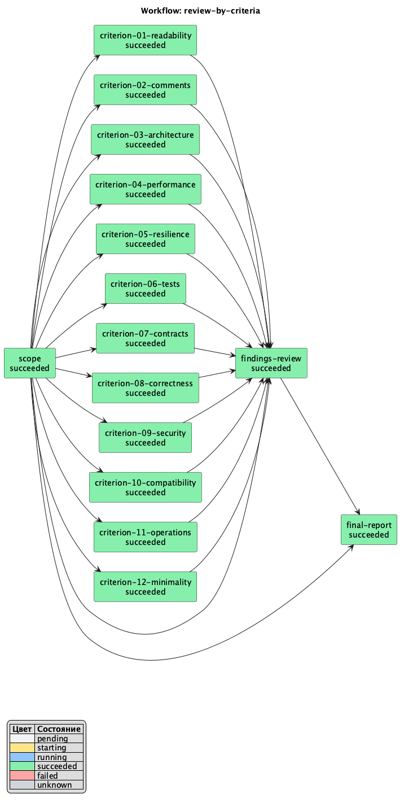
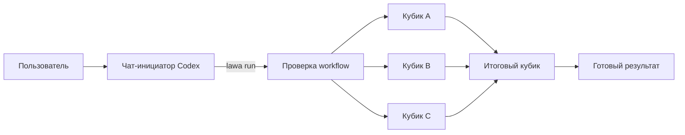

<p align="center">
  
</p>

<h1 align="center">Lawa</h1>

<p align="center">
  <strong>Workflow-оркестратор для параллельной работы AI-агентов в Codex.</strong><br>
  Опишите граф задач в JSON — Lawa запустит независимые ветки параллельно,
  дождётся зависимостей и сохранит состояние для безопасного продолжения.
</p>

<p align="center">
  
  
  
</p>

---

Lawa превращает большую задачу в управляемый поток отдельных задач Codex —
«кубиков». У каждого кубика есть собственный промпт, отдельный чат и явные
зависимости. Как и лава, работа свободно течёт по готовым веткам графа, а затем
собирается в общий результат.

## Реальный запуск: ревью по 12 критериям

В этом запуске Lawa провела полное ревью репозитория через 15 отдельных задач
Codex. Сначала кубик `scope` зафиксировал единый снимок проекта. Затем 12 агентов
одновременно проверили читаемость, архитектуру, тесты, безопасность и остальные
критерии. `findings-review` перепроверил и объединил замечания, а `final-report`
собрал итоговый отчёт.

<p align="center">
  
</p>

Результат запуска: **15 из 15 кубиков завершены**, итоговая оценка — **84/100**,
в отчёт вошло 20 проверенных элементов, а 9 неподтверждённых кандидатов были
отброшены или объединены. Это и есть основной сценарий Lawa: один контекст →
параллельные независимые проверки → критическая перепроверка → один результат.

## С Lawa и без Lawa

| Что происходит | Без Lawa | С Lawa |
| --- | --- | --- |
| Независимые задачи | Агент выполняет их по очереди или пользователь вручную создаёт отдельные чаты | Готовые кубики автоматически стартуют параллельно |
| Зависимости | Порядок и готовность входов приходится отслеживать вручную | Граф запускает следующий кубик только после успешных зависимостей |
| Контекст | Общий чат постепенно смешивает разные предметные области | У каждого кубика отдельный prompt, чат и память |
| Пауза или сбой | Продолжение собирается вручную из истории чатов | `resume` продолжает сохранённый run без повторного запуска готовых кубиков |
| Наблюдение | Статусы нужно сверять по отдельным чатам | Lawa сохраняет общий статус, ссылки и схему workflow |
| Итог | Выводы сводит пользователь или тот же перегруженный контекстом агент | Отдельный итоговый кубик получает результаты зависимостей и собирает отчёт |

Для короткой линейной задачи Lawa обычно не нужна: её проще оставить одному агенту.
Оркестратор полезен, когда в работе есть несколько независимых веток и этап, который
должен дождаться их общего результата.

## Установка

Готовый бинарник не требует Go. Поддерживаются macOS и Linux на `amd64` и
`arm64`. Нужны `curl` или `wget`, а для запуска workflow — установленный и
авторизованный Codex CLI в `PATH`.

### Установка через Codex-агента

Самый простой вариант — отправить агенту этот запрос:

```text
Установи последнюю стабильную Lawa на этот компьютер. Скачай install.sh из
https://github.com/stray-live-pixel/Lawa/releases/latest/download/install.sh
во временный файл и сначала запусти его с --plan. Покажи мне версию, пути,
изменение PATH и состояние PlantUML. Если PlantUML отсутствует, отдельно спроси
разрешение на показанную системную команду. После моего ответа запусти тот же
временный install.sh с --yes; добавь --install-plantuml только если я явно
разрешил установку. В конце проверь lawa version, lawa help и установленный скилл.
После успешной проверки покажи, что делать дальше: дай пример запроса на создание
нового workflow и пример его запуска через установленный скилл lawa.
```

Агент должен использовать один и тот же временный файл для `--plan` и установки:
так между подтверждением и записью не подменится выбранная версия. Обычный
`--yes` разрешает только показанные файлы Lawa и изменение `PATH`. Системный
пакетный менеджер и `sudo` разрешает только отдельный `--install-plantuml`.

### Установка из терминала

Интерактивная установка последней стабильной версии:

```sh
curl -fsSL https://github.com/stray-live-pixel/Lawa/releases/latest/download/install.sh | sh
```

Если `curl` отсутствует:

```sh
wget -qO- https://github.com/stray-live-pixel/Lawa/releases/latest/download/install.sh | sh
```

Только посмотреть план без загрузки release assets и изменений:

```sh
curl -fsSL https://github.com/stray-live-pixel/Lawa/releases/latest/download/install.sh | sh -s -- --plan
```

Перед изменениями установщик показывает версию и точные пути. По умолчанию это:

```text
бинарник: ~/.local/bin/lawa
скилл:    ~/.codex/skills/lawa/SKILL.md
```

Если `~/.local/bin` отсутствует в `PATH`, установщик заранее показывает выбранный
shell profile и добавляемую строку. Подтверждение по умолчанию — `Нет`; при
`curl | sh` ответ читается из `/dev/tty`, а не из загруженного скриптом stdin.

#### Что делать после установки

Пользователю не нужно писать JSON вручную. Сначала попросите агента подготовить
workflow под задачу, например для отчёта о проекте:

```text
Создай workflow Lawa для отчёта по этому проекту. Пусть независимые агенты
параллельно изучат документацию, код и тесты, а итоговый агент соберёт краткий
Markdown-отчёт с выводами и рисками. Сохрани workflow в
workflows/project-report.json и проверь командой
lawa validate workflows/project-report.json.
```

Затем запустите созданный файл через установленный скилл:

```text
$lawa workflows/project-report.json
Подготовь актуальный отчёт о состоянии проекта и предложи следующие шаги.
```

В репозитории Lawa также есть готовые примеры: компактное
[`review.json`](examples/review.json), подробное
[`review-by-criteria.json`](examples/review-by-criteria.json) и технический
[`integration-smoke.json`](examples/integration-smoke.json). После запуска
оставайтесь в исходном чате: агент покажет `runId`, созданные задачи и их статусы.
Подробнее — в разделе [«Запуск из Codex App»](#запуск-из-codex-app).

### PlantUML

Установщик всегда запускает `plantuml -version` до изменения Lawa. Без PlantUML
workflow и текстовые статусы работают, но `workflow-status.png` не создаётся.
Если команда недоступна, установщик показывает подходящий вариант:

```sh
# macOS
brew install plantuml

# Debian/Ubuntu
sudo apt-get update
sudo apt-get install -y plantuml

# Fedora
sudo dnf install -y plantuml

# Arch Linux
sudo pacman -S --needed --noconfirm plantuml
```

В интерактивном режиме установка PlantUML имеет отдельный вопрос с ответом
`Нет` по умолчанию. Для агента или CI нужны оба флага:

```sh
sh install.sh --yes --install-plantuml
```

Перед `sudo` печатается точная команда. После пакетного менеджера повторно
проверяется `plantuml -version`; ошибка останавливает процесс до изменения
бинарника и скилла Lawa. Для неизвестного пакетного менеджера автоматическая
установка запрещена — используйте
[официальную инструкцию PlantUML](https://plantuml.com/command-line).

### Проверка и PATH

После установки откройте новую shell-сессию и выполните:

```sh
command -v lawa
lawa version
lawa help
test -f "${CODEX_HOME:-$HOME/.codex}/skills/lawa/SKILL.md"
plantuml -version
```

Если текущая сессия ещё не видит Lawa, выполните строку `export PATH=...`, которую
напечатал установщик, или перечитайте изменённый profile. После обновления скилла
перезапустите Codex либо обновите список скиллов.

Пути и версия переопределяются аргументами или окружением:

```sh
sh install.sh --version v0.1.1 \
  --install-dir "$HOME/bin" \
  --codex-home "$HOME/.codex"

LAWA_VERSION=v0.1.1 \
LAWA_INSTALL_DIR="$HOME/bin" \
LAWA_CODEX_HOME="$HOME/.codex" \
sh install.sh
```

Пути должны быть абсолютными; пробелы поддерживаются. `--plan` не скачивает
release assets и ничего не изменяет. Неподдерживаемая платформа, отсутствие
инструментов, ошибка сети, неверный checksum или сбой записи завершаются понятной
ошибкой. Прежний рабочий бинарник и скилл восстанавливаются при ошибке публикации.

### Обновление

```sh
lawa update
```

Команда показывает переход версии и пути, скачивает `install.sh` и
`SHA256SUMS` из последнего стабильного GitHub Release, проверяет SHA-256 скрипта
и только затем запускает его. Установщик повторно проверяет checksum архива.
Неинтерактивное обновление файлов Lawa:

```sh
lawa update --yes
```

`lawa update --yes --install-plantuml` допустим только после отдельного согласия
пользователя. Для нестандартного корня скиллов передайте `--codex-home`. Сборка
`dev` не обновляет себя и предлагает установить официальный release.

### Ручная проверка конкретного release

Для аудита без `curl | sh` скачайте три asset одного тега:

```sh
version=v0.1.1
base="https://github.com/stray-live-pixel/Lawa/releases/download/$version"
archive="lawa_${version}_darwin_arm64.tar.gz" # выберите свою ОС/архитектуру
curl -fLO "$base/install.sh"
curl -fLO "$base/SHA256SUMS"
curl -fLO "$base/$archive"
```

Сверьте только скачанные файлы. На Linux:

```sh
awk -v archive="$archive" '$2 == "install.sh" || $2 == archive' SHA256SUMS | sha256sum -c -
```

На macOS:

```sh
awk -v archive="$archive" '$2 == "install.sh" || $2 == archive' SHA256SUMS | shasum -a 256 -c -
```

После двух ответов `OK` запустите `sh install.sh --version "$version"`. Не
смешивайте файлы разных тегов.

### Удаление

Узнайте пути через `command -v lawa` и `echo "${CODEX_HOME:-$HOME/.codex}"`, затем
удалите только установленные файлы:

```sh
rm "$HOME/.local/bin/lawa"
rm "$HOME/.codex/skills/lawa/SKILL.md"
```

Если установщик добавлял `export PATH=...`, удалите показанную строку и соседний
комментарий Lawa из `.zshrc`, `.bashrc` или `.profile`. Пользовательские workflow
и run в `~/.light-ai-workflows` автоматически не удаляются.

Бинарники macOS первого релиза не подписаны и не notarized. Если Gatekeeper
блокирует скачанный файл, проверьте тег и SHA-256 перед ручным разрешением запуска.

## Зачем нужна Lawa

Один агент хорошо решает последовательную задачу. Но ревью, исследование,
рефакторинг или подготовка релиза часто состоят из независимых частей. Их можно
выполнить одновременно, а итоговый этап запустить только после готовности всех
входов.

Lawa берёт на себя механику такого процесса:

- проверяет JSON-схему, ссылки между кубиками и отсутствие циклов;
- запускает независимые кубики параллельно в отдельных задачах Codex App;
- передаёт каждому агенту общую постановку и его локальный промпт;
- ждёт успешного завершения всех зависимостей перед запуском следующего кубика;
- сохраняет связи с чатами, статусы и отдельную память агентов;
- продолжает тот же запуск после остановки, не создавая дубликаты задач;
- адресно прерывает активные turn при `Ctrl+C` или `SIGTERM`.

Lawa не заменяет Codex и не вызывает модель напрямую. Инструменты, авторизация и
ограничения задаются в Codex. По умолчанию модель и режим рассуждения тоже
наследуются из Codex, но workflow может явно переопределить `model`, `effort` и
`speed` для отдельного кубика. Lawa отвечает за граф, состояние и координацию.

## Как это работает



Чат-инициатор остаётся интерфейсом управления: в нём пользователь запускает
workflow, получает `runId`, следит за важными изменениями и продолжает остановленный
запуск. Каждый кубик выполняется в своей задаче Codex и остаётся видимым в приложении.

## Запуск из Codex App

Основной сценарий не требует вручную собирать длинную CLI-команду:

1. Сформулируйте задачу в отдельном чате Codex.
2. Вызовите установленный скилл `lawa` и укажите файл workflow. В интерфейсе это
   может отображаться как `$lawa` или `/lawa`.
3. Агент проверит JSON, сохранит постановку задачи и запустит Lawa в рабочей папке.
4. Оставайтесь в чате-инициаторе: он сообщит `runId`, статусы и необходимость
   ручного вмешательства.

Пример запроса:

```text
$lawa examples/review-by-criteria.json
Проверь приложение целиком на текущем HEAD. Не учитывай generated-файлы и зависимости.
```

Для каждого готового кубика Lawa создаст отдельную задачу Codex. Модель для этих
задач не зашита в Lawa: используется конфигурация Codex, действующая в окружении
запуска.

## Формат workflow

Workflow — один JSON-объект с непустым `id` и массивом `steps`. У каждого кубика
обязательны четыре поля:

| Поле | Назначение |
| --- | --- |
| `id` | Уникальный ID кубика внутри workflow |
| `type` | Сейчас поддерживается только значение `agent` |
| `prompt` | Самостоятельная инструкция агенту |
| `dependsOn` | ID кубиков, успеха которых нужно дождаться |

У кубика также есть три необязательных поля исполнения:

| Поле | Назначение |
| --- | --- |
| `model` | Непустой ID модели Codex без пробелов |
| `effort` | Непустой reasoning effort, поддерживаемый выбранной моделью |
| `speed` | `normal` для обычного режима или `fast` для Fast mode Codex |

Каждое поле можно задавать независимо. Отсутствующее поле наследуется из Codex.
Явный `normal` отключает унаследованный Fast mode для этого кубика. Lawa не
хардкодит меняющийся каталог моделей и их effort: несовместимое сочетание
отклоняет Codex, а Lawa показывает его ошибку без подстановки другого режима.

Пустой `dependsOn` разрешает немедленный запуск. Порядок элементов в `steps` не
управляет исполнением — его задают только зависимости.

```json
{
  "id": "code-review",
  "steps": [
    {
      "id": "architecture",
      "type": "agent",
      "prompt": "Проведи архитектурное ревью и сохрани доказательные выводы.",
      "dependsOn": [],
      "model": "gpt-5.6-sol",
      "effort": "high",
      "speed": "normal"
    },
    {
      "id": "security",
      "type": "agent",
      "prompt": "Проверь границы доверия и обработку чувствительных данных.",
      "dependsOn": [],
      "speed": "fast"
    },
    {
      "id": "summary",
      "type": "agent",
      "prompt": "Собери общий Markdown-отчёт и расставь приоритеты.",
      "dependsOn": ["architecture", "security"]
    }
  ]
}
```

Проверить файл без запуска Codex:

```sh
./bin/lawa validate workflow.json
```

Валидация отклоняет неизвестные поля, повторные ключи, неверные типы, пустые
обязательные значения и настройки, неизвестный `speed`, несуществующие и
повторные зависимости, а также прямые и косвенные циклы. Файл должен содержать
ровно один JSON-объект.

Готовые примеры:

- [`examples/review.json`](examples/review.json) — компактное ревью с параллельными ветками;
- [`examples/review-by-criteria.json`](examples/review-by-criteria.json) — подробное ревью по 12 критериям с перепроверкой и разделением продуктовых и технических замечаний;
- [`examples/integration-smoke.json`](examples/integration-smoke.json) — сквозная проверка интеграции.

## CLI

```text
lawa run <workflow.json> --cwd <проект> \
  (--task <текст> | --task-file <путь>) \
  --initiator-thread-id <id>

lawa resume <run-id>
lawa validate <workflow.json>
lawa skill
lawa version
lawa update [--yes] [--install-plantuml] [--codex-home <путь>]
lawa help
```

Для многострочной постановки и текста со специальными символами используйте
`--task-file` и `--comment-file`: содержимое файлов не интерпретируется оболочкой.
Полный список параметров всегда доступен через `lawa help`.

| Код выхода | Значение |
| ---: | --- |
| `0` | Все кубики успешно завершены |
| `2` | Ошибка входных данных, состояния или интеграции |
| `130` | Остановка через `SIGINT` |
| `143` | Остановка через `SIGTERM` |

### Статус в чате-инициаторе

Во время `run` и `resume` Lawa печатает в stdout только короткую статистику и
ссылку на папку запуска. Первый снимок и финальный успех выводятся сразу,
промежуточная сводка — не чаще одного раза в 5 минут:

```text
Всего: 15, готово: 5, работает: 6, ожидают: 4.
Открыть статус в VS Code
```

Агент переносит этот короткий блок в чат без списка кубиков и без картинки. Ошибка,
отмена, неизвестное состояние или ожидание подтверждения получают отдельный счётчик
`требуют внимания`, поэтому проблема не маскируется под обычное ожидание.

Подробный `workflow-status.md`, PlantUML source и PNG обновляются локально при
каждом изменении и не реже одного раза в минуту. Markdown содержит все кубики,
ссылки на их задачи Codex и встроенную текущую картинку. VS Code-ссылка из сводки
открывает папку run, где можно следить за этими файлами без расхода токенов чата.

PNG рендерится локальной командой `plantuml -pipe`; способ установки и требования
Java/Graphviz зависят от ОС и описаны в
[документации PlantUML](https://plantuml.com/command-line). Ошибка renderer не
останавливает workflow: Markdown и source остаются актуальными, старый PNG удаляется,
а ближайшая чат-сводка получает короткое предупреждение.

## Состояние и продолжение

Каждый запуск сохраняется в `~/.light-ai-workflows/<run-id>/`:

```text
<run-id>/
├── workflow.json          # неизменяемый снимок графа
├── task.md                # постановка и комментарий пользователя
├── meta.json              # статусы и связи с чатами Codex
├── workflow-status.md     # подробный статус со ссылками и встроенной картинкой
├── workflow-status.puml   # последний PlantUML source статуса
├── workflow-status.png    # картинка того же снимка, если renderer доступен
└── memory/
    └── <thread-id>.md     # отдельная память каждого кубика
```

Метаданные обновляются атомарно, а один run блокируется от одновременного управления
двумя процессами. Намерение создать чат сохраняется до сетевого запроса — это не
даёт незаметно запустить один кубик дважды после сбоя.

```sh
./bin/lawa resume <run-id>
```

`resume` открывает тот же run, сверяет сохранённые чаты и запускает только новые
готовые кубики. Если последний turn был прерван, Lawa отправляет один `continue` в
тот же чат с `model`, `effort` и `speed` из сохранённого `workflow.json`. Упавший
кубик пользователь продолжает вручную; успешно завершённый не перезапускается.

Только успешный статус кубика открывает его зависимости. Ошибка, отмена или ожидание
подтверждения не останавливают независимые ветки, но зависимые кубики продолжат ждать.

## Безопасность и границы ответственности

- Lawa сохраняет стандартные sandbox-ограничения и managed restrictions Codex.
- Кубики работают с `approvalPolicy: on-request` и встроенной автопроверкой запросов
  прав; Lawa не подтверждает повышение прав самостоятельно.
- Системные файлы run доступны агентам только для чтения. Каждый агент может менять
  только собственный файл памяти, но читать память зависимых коллег.
- Общие рабочие файлы проекта не защищены от логических конфликтов между параллельными
  агентами. Если одному кубику нужен результат другого, задайте это через `dependsOn`.
- Lawa не оценивает смысл ответа агента и не проверяет созданные им артефакты: успех
  определяется терминальным статусом задачи Codex.
- Собственного лимита параллельности и таймаута нет; действуют ограничения Codex и
  окружения пользователя.

## Разработка

Для сборки из исходников нужен Go из `go.mod`:

```sh
git clone https://github.com/stray-live-pixel/Lawa.git
cd Lawa
go build -o bin/lawa ./cmd/lawa
./bin/lawa version # dev
./bin/lawa help
```

Локальная версия намеренно равна `dev`. Release workflow задаёт tag через linker
metadata и собирает автономные бинарники с `CGO_ENABLED=0`.

```sh
go test -race -count=1 ./...
go vet ./...
go mod tidy -diff
sh -n install.sh
shellcheck --shell=sh install.sh
```

Основные модули:

```text
cmd/lawa/             CLI, сигналы, preflight и встроенный SKILL.md
internal/buildinfo/   единый источник версии release-сборки
internal/workflow/    строгий разбор и проверка JSON-графа
internal/scheduler/   расчёт готовых и ожидающих кубиков
internal/coordinator/ запуск волн, наблюдение и восстановление
internal/codex/       клиент Codex App Server
internal/runstore/    атомарное хранение и блокировка run
internal/statusreport/ ссылки, текстовый статус и PlantUML-артефакты
```

## Документация

- [Продуктовые требования MVP](product/1.md)
- [План и состояние реализации](docs/mvp-roadmap.md)
- [Проверка интеграции с Codex App](docs/codex-integration.md)
- [Последнее комплексное ревью](docs/review.md)
- [Инструкция встроенного скилла](cmd/lawa/SKILL.md)

## Статус проекта

MVP реализован: доступны `validate`, `run`, `resume`, установка скилла, параллельные
ветки, зависимости, минутные локальные отчёты, пятиминутная чат-сводка, сохранение
состояния, ручное продолжение и адресное прерывание.
Интеграция проверена живыми пятикубиковыми сценариями на macOS с Codex Desktop.

Текущие ограничения и план развития зафиксированы в
[`docs/mvp-roadmap.md`](docs/mvp-roadmap.md). Воспроизводимые проблемы можно сообщать
через [GitHub Issues](https://github.com/stray-live-pixel/Lawa/issues).
