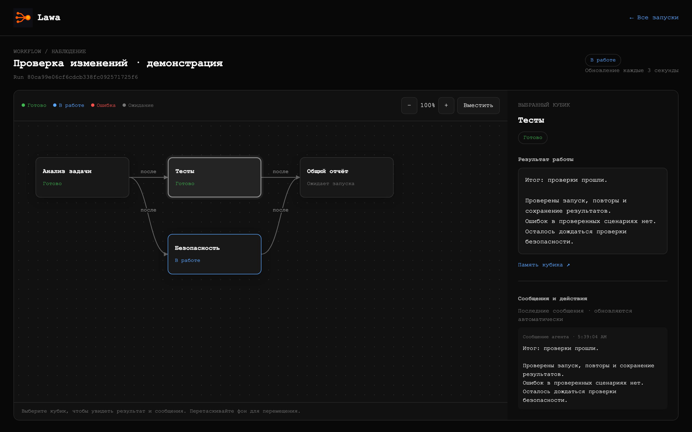

<p align="center">
  
</p>

<h1 align="center">Lawa</h1>

<p align="center">
  <strong>Workflow-оркестратор параллельной работы AI-агентов через Codex App Server.</strong><br>
  Опишите строгий DAG или agent-граф в JSON — Lawa запустит готовые ветки,
  сохранит решения и предоставит единый интерфейс наблюдения.
</p>

## Что даёт Lawa

Каждое исполнение кубика получает отдельный prompt, thread Codex и файл памяти.
Legacy workflow образуют строгий DAG: независимые кубики стартуют параллельно, а
зависимые — только после успешного завершения входов. Workflow version 2 могут
дождаться любого технического исхода, поручить отдельному агенту выбор именованного
маршрута и безопасно повторить ограниченный участок графа. После сигнала или сбоя
run остаётся на диске и продолжается по тому же ID.

Пользователю не нужно работать с протоколом Codex:

```text
lawa run / resume
        │
        ▼
  фасад Lawa
  ├── процессы codex app-server
  ├── thread и turn
  ├── зависимости, решения и параллельные волны
  ├── meta.json и events.jsonl
  └── status / logs / dashboard
```

Для короткой линейной задачи Lawa обычно не нужна. Она полезна, когда есть
несколько независимых исследований, отдельный этап сборки результата, агентное
ветвление или цикл проверки и исправления.

## Личности и Босс

Есть два способа работы. `lawa run` исполняет заданный граф, как раньше.
`lawa order` создаёт Босса для одного заказа Чела — человека в интерактивном
чате Codex. Босс получает исходный текст без пересказа. Сложность заказа
не ограничена схемой: он может исследовать, выполнять работу, задавать вопросы
и делегировать через существующие `run_child/run_children`.

```sh
# Новый заказ без обязательного workflow
lawa order --cwd /absolute/project --task-file goal.md
# Либо передать Боссу процесс и описания личностей
lawa order examples/characters.json --cwd /absolute/project --task-file goal.md
# Ответить тому же Боссу в том же Codex thread
lawa reply <run-id> --task-file answer.md
```

Команды печатают `runId` и ответ Босса. Вызывающий агент Codex передаёт вопросы
Челу, а его ответы — через `reply`. Новый `order` всегда создаёт нового Босса.
Конец ответа и технический `succeeded` означают завершение хода разговора;
отдельного состояния «цель заказа достигнута» пока нет. `resume` восстанавливает
прерванную работу, а `reply` передаёт новую реплику. При неоднозначной доставке
после сбоя сообщение автоматически не повторяется: нужно проверить историю
Codex; `resume` может восстановить подтверждённый новый turn.

Состав команды офиса задаётся через CLI: `lawa serve --team-config team.json --cwd /project --task-file goal.md`.
[Пример с Дизайнером](examples/office/team.json) задаёт `name`, `history`,
`instructions` и `avatar` для каждого ID. Босс приглашает нужных сотрудников
сам; [описание конфигурации и правил чата](docs/team-room.md).
`lawa metrics <run-id>` читает [отчёт времени, ожиданий и токенов](docs/team-metrics.md)
из team.json без запуска агентов.

Каждое поручение сотруднику учитывается отдельно. Босс проверяет результат и
принимает его через `team_accept`, указывая отчёт и выполненную проверку.
Непринятые поручения запрещают завершение цели. Сбой или ход без отчёта
адресно будит Босса; `team_retry` разрешает повтор только доказанно
неотправленной работы. Приёмка фиксирует решение Босса, а не доказывает
качество артефакта автоматически: проверку исходной цели выполняет сам агент.

В JSON поле `characters` описывает личности: `name`, `history` (предыстория),
`instructions` (принципы и границы). Кубик ссылается на личность через `character`.
Пример — [examples/characters.json](examples/characters.json). Это работает
в обоих форматах workflow; без `characters` всё остаётся как раньше.
Для `order` допустим и файл только с `id` и `characters.boss`, без `steps`.
Если полный workflow не описывает `boss`, используется встроенный Босс.

В папке run сохраняются исходный `task.md`, описание Босса в `workflow.json`,
необязательный раскрытый `assigned-workflow.json`, реплики Чела и их turn ID
в `meta.json.order`, а также прежний журнал событий. История разговора находится
в Codex thread. Приобретённый опыт личности — в `memory/character-<id>.md`,
отдельно от памяти конкретных исполнений. Один персонаж выполняет свои кубики
последовательно; разные персонажи могут работать параллельно. Память живёт
внутри run: отдельный дочерний workflow получает собственные экземпляры.

В режиме `order` после дочерней работы для следующего решения Босса может
понадобиться `reply`. Командный офис использует отдельный адресный runtime,
описанный ниже.

## Единственный runtime: App Server

Lawa запускает официальный `codex app-server --stdio` напрямую. Отдельного
app-native режима, `--mode` и команд второго протокола нет. Один CLI одинаково
работает на личном macOS/Linux и на Linux-сервере. Установленный Codex Desktop не
меняет способ исполнения; нужен доступный и авторизованный Codex CLI.

Lawa сознательно не создаёт нативные задачи Codex Desktop. У Desktop нет публично
документированного программного API, через который внешний Go-процесс мог бы
создавать, продолжать и наблюдать такие задачи. Посредник в виде управляющего
агента добавлял бы модельные запросы, задержку, стоимость и узкое место при
параллельном запуске множества workflow. Поэтому наблюдаемость реализована самой
Lawa, а появление App Server thread в Desktop не гарантируется.

Полное решение и условие его пересмотра описаны в
[исследовании интеграции](docs/codex-integration.md). Основа протокола —
[официальная документация Codex App Server](https://learn.chatgpt.com/docs/app-server).

## Установка

Готовые бинарники поддерживают macOS и Linux на `amd64` и `arm64`.

```sh
curl -fsSL https://github.com/stray-live-pixel/Lawa/releases/latest/download/install.sh | sh
```

Если `curl` отсутствует:

```sh
wget -qO- https://github.com/stray-live-pixel/Lawa/releases/latest/download/install.sh | sh
```

Сначала показать план без изменений:

```sh
curl -fsSL https://github.com/stray-live-pixel/Lawa/releases/latest/download/install.sh |
  sh -s -- --plan
```

По умолчанию устанавливаются:

```text
бинарник: ~/.local/bin/lawa
скилл:    ~/.codex/skills/lawa/SKILL.md
```

Установщик отдельно спрашивает разрешение на изменение PATH и системную установку
PlantUML. Для неинтерактивного запуска:

```sh
sh install.sh --yes
```

После установки проверьте окружение:

```sh
command -v lawa
command -v codex
lawa version
lawa help
codex --version
codex login status
```

Codex CLI должен быть авторизован для App Server. Если `codex login status` не
подтверждает активный вход, сначала настройте его от того же системного
пользователя, который будет запускать Lawa:

```sh
# Компьютер с браузером
codex login

# Удалённый или headless-сервер
codex login --device-auth
```

Для доверенной неинтерактивной автоматизации Codex также поддерживает API key:

```sh
printenv OPENAI_API_KEY | codex login --with-api-key
```

API key использует тарификацию OpenAI Platform. Не передавайте ключ или
`~/.codex/auth.json` через аргументы Lawa, workflow, task, журналы, issue или чат:
файл содержит токены и должен обрабатываться как пароль. Подробности, включая
настройку device code и запасные способы входа, приведены в
[официальной документации авторизации Codex](https://learn.chatgpt.com/docs/auth).

На удалённом сервере авторизация, `cwd`, workflow и root должны быть доступны
тому же системному пользователю, который запускает Lawa. Вход в Codex Desktop на
другом компьютере не заменяет эту проверку.

Обновление и удаление:

```sh
lawa update
sh install.sh --uninstall
```

Граф dashboard не требует PlantUML, Java или Graphviz. Новые run сохраняют
Markdown-статус; граф строится программно из состояния запуска.

## Быстрый старт

Проверьте граф:

```sh
lawa validate examples/review.json
```

Для agent-графов version 2 доступны два готовых сценария:

```sh
lawa validate examples/fix-until-green.json
lawa validate examples/risk-routing.json
```

Первый безопасно повторяет `test → checker → fix` до решения агента или лимита,
второй выбирает terminal safe-ветку либо параллельный анализ найденного риска.

Запустите выбранный workflow. Для многострочного или shell-чувствительного текста
используйте файлы:

```sh
lawa run examples/review.json --cwd /absolute/project \
  --task-file /absolute/task.md \
  --comment-file /absolute/comment.md \
  --max-parallel 4
```

Lawa напечатает `runId` и откроет его UI в браузере (`/graph/<runId>`).
Локальный сервер использует свободный порт на `127.0.0.1` и указанное хранилище
`--root`; работает до завершения команды. Для запуска без сервера UI и браузера
добавьте `--no-ui`:

```sh
lawa run examples/review.json --cwd /absolute/project --task-file /absolute/task.md --no-ui
```

Если браузер недоступен, Lawa напечатает ссылку и продолжит workflow.
В серии сервер общий, страница открывается для каждого нового run; `--no-ui`
отключает UI всей серии. После завершения команды сохранённый результат можно
посмотреть через `lawa serve --root <то же хранилище>`.

Команда остаётся в foreground и наблюдает workflow до
результата. Не отправляйте её в случайный фоновый shell: для долговечной работы
используйте supervisor, systemd или другой контролируемый процесс.

`--max-parallel N` задаёт суммарное число активных turn для всего `--root`, а не
только для одного workflow. Значение сохраняется и применяется к параллельно
запущенным процессам `lawa run` и `lawa resume` с тем же root. Поэтому достаточно
задать его один раз; позднее тот же флаг меняет настройку. Уменьшение не прерывает
уже работающие turn и ограничивает следующие. Если настройка ещё ни разу не
задавалась, Lawa сохраняет совместимое поведение без собственного лимита.

Для продолжения:

```sh
lawa resume <run-id>
```

`resume` сверяет сохранённые thread и продолжает только явно interrupted-кубики:
в workflow v2 это сохранённые `cancelled` visits. Успешные и технически упавшие
исполнения не перезапускаются; `failed` может стать входом следующего кубика через
`after`. Не создавайте новый run после неоднозначной ошибки `thread/start`: thread
мог быть создан, а повтор породит дубль.

## Дочерние workflow

Каждый кубик автоматически получает два узких инструмента: `run_child` для одного
дочернего workflow и `run_children` для группы до 32 запусков. Кубик передаёт
`workflow`, `cwd`, ровно одно из `task`/`taskFile` и текущий `parentRun`.
Lawa сама проверяет вход, создаёт обычный run в том же хранилище и только после
надёжной публикации возвращает `runId` или `runIds`.

Дочерние workflow используют тот же Codex, обычное хранилище и общий
`--max-parallel`. Команда верхнего run остаётся владельцем всего дерева и ждёт
потомков; отдельного daemon нет. Повтор одного и того же запроса на занятую задачу
возвращает прежний `runId`, а не создаёт дубль. Точная повторная доставка tool call
остаётся идемпотентной и после успеха, но новый запрос запускает завершённую задачу
заново.

Инструмент не является привилегированной оболочкой. Каждый дочерний `cwd` —
существующий абсолютный каталог, разрешённый активной политикой Codex; одна пачка
`run_children` может использовать разные каталоги. Lawa открывает каталог до
регистрации run и запускает App Server через удерживаемый дескриптор, поэтому
подмена проверенного пути симлинком не перенаправляет процесс. Файлы workflow и
task-file по-прежнему читаются через безопасный корень только из workspace родителя
или read-only папки родительского run. Managed restrictions и approvals не
ослабляются; отказ доступа возвращается до создания дочернего run.

## Observability

Наблюдение не запускает модель и не требует агента-посредника:

```sh
lawa status <run-id>
lawa logs <run-id>
lawa logs <run-id> <step-id>
lawa logs <run-id> <step-id> --follow
lawa logs <run-id> --visit <visit-id>
lawa logs <run-id> --visit <visit-id> --follow
lawa serve
```

`status` показывает состояние кубиков, thread/turn, PID App Server, тип текущего
действия, последнюю активность и краткую ошибку. Для workflow v2 он дополнительно
показывает `visitId`, номер посещения и итерации, решение, выбранный маршрут,
невыбранные ключи и отдельные visits в состоянии `skipped`, лимит и причину
завершения. `logs` читает безопасное для терминала
текстовое представление приватного `events.jsonl`: lifecycle процесса, thread/turn,
тип item, финальный agent message, ошибку и числовые счётчики token usage.
Позиционный `step-id` выбирает все посещения логического кубика, а `--visit`
изолирует ровно одно исполнение. Эти формы взаимоисключающие. Более подробное поле
live-вывода при этом в терминал не попадает.

`logs --follow` читает только новые полные строки журнала. После терминального
состояния run он сначала печатает финальные события действительно запущенных turn
и только затем завершается. Для `skipped`-visit события исполнителя нет: Codex для
такой ветки не запускался, а её итог уже атомарно сохранён в `meta.json`.

Для боковой панели dashboard журнал также сохраняет сообщения агента, краткие
объяснения reasoning summary, план, команду и её потоковый вывод, а для других
действий — только ограниченно выбранные имена и пути. В журнал не копируются raw
reasoning, MCP/tool arguments и results, file diff, неизвестные payload и сырые
rollout Codex.

Live-вывод команды и текст агента могут содержать секреты проекта. Поэтому весь
`events.jsonl` создаётся с правами `0600`, но его всё равно следует считать
приватным. CLI `status` и `logs` намеренно не показывают это подробное поле.
Перед выводом в терминал Lawa показывает управляющие символы как текст, например
`\u001B`. Точные сообщения и ID в файлах run при этом не изменяются.

`lawa serve` поднимает dashboard и общий чат на
[http://127.0.0.1:60800](http://127.0.0.1:60800). Новые workflow находятся сверху
по времени создания. Legacy-шаги сохраняют порядок исходного workflow, а у
workflow v2 каждое посещение показано отдельной строкой `step #visit`; новые
события не переставляют элементы дерева. В деталях visit видны trigger, iteration,
attempt, решение и объяснение, выбранный переход, skipped-ключи, отдельные
`skipped`-ветки, техническая
диагностика и точные ссылки на журнал и память. По умолчанию фильтр «Активные» скрывает полностью завершённые деревья;
кнопка «Все» возвращает их с учётом поиска и периода. «В работе» оставляет
выполняющиеся ветки, а «Сломавшиеся» — failed, cancelled и unknown; оба режима
сохраняют папки-предки нужных кубиков. Слева инспектор показывает связь workflow-папок и компактных кубиков, а
цвет самой иконки сообщает статус. ID связанного тикета показан label рядом с
названием папки. Pin-кнопка закрепляет вложенный workflow как
корень; общий header инспектора показывает путь без видимой полосы прокрутки, а
первая серая папка `../` возвращает к родителю. Выбранный workflow или кубик подробно
показан справа; оттуда доступны live-вывод, память, события, тикеты и папка run.
Кнопка «Остановить и удалить» завершает активные процессы Codex выбранного workflow,
дожидается остановки координатора и удаляет его run. Уже исчезнувший процесс не
мешает удалению.
Клик по папке выбирает run без изменения дерева; отдельный шеврон рядом сворачивает
и разворачивает её потомков.
Выбор workflow в левом списке открывает схему: масштабирование,
перемещение и выбор кубика. Справа — статус, сообщения и финальный отчёт.
Для циклов можно выбрать конкретное посещение; схема показывает и ещё не
запущенные кубики, зависимости `after`/`dependsOn` и именованные маршруты.
Выбор, масштаб и прокрутка сохраняются при обновлении.



Новые агенты получают встроенные правила mom и concise: короткий итог простыми
словами, выполненная работа, проверки и ограничения. Финальный ответ с маркером
`Итог:` сохраняется в `events.jsonl` и читается после перезапуска. UI принимает
только завершённое сообщение текущего turn конкретного посещения. Пока кубик
работает, итог не показывается; для пропуска агент не запускался. Если агент
не прислал отчёт или запуск создан старой версией, UI явно сообщает об отсутствии
итога и оставляет доступ к сообщениям и памяти. Текст не меняет технический статус.
Dashboard не читает внутренние каталоги Codex,
не показывает raw reasoning и не отдаёт raw rollout. В header dashboard показывает
workflow и время до ближайшего запуска. Клик открывает боковую панель со всеми
сохранёнными `nextRunAt` активных серий; просроченное ожидание остаётся видимым как
диагностика. Автообновление не заменяет неизменившийся интерфейс и откладывает
замену блока с выделенным текстом, активным полем или открытой панелью расписания.
Dashboard занимает высоту окна: дерево и детали прокручиваются независимо. Статус
и период применяются сразу, поиск находится над деревом, а временная навигация —
рядом с верхними фильтрами. Выбранный корень и фильтр состояний сохраняются при
поиске, смене периода и переходе между временными окнами.
При автообновлении dashboard читает из всех run только компактные `meta.json` и
метаданные файлов. `events.jsonl` загружается только для открытого кубика и
обновляется раз в 10 секунд. Явный полнотекстовый поиск запускается через секунду
после окончания ввода и просматривает все журналы и memory, поскольку совпадение
может находиться внутри сообщения агента или сохранённой памяти.

### Нарративный офис и адресный чат

`/office` — отдельная страница того же UI с общей темой Gravity UI. Команда
создаётся только при запуске CLI:

```sh
lawa serve --team-config examples/office/team.json --cwd /absolute/project --task-file goal.md
```

В новом заказе сначала только Босс; без заказа комната пуста. CLI сохраняет
дословный pin, **сразу запускает Босса** и печатает `/office?run=<run-id>`.
Для продолжения существующих команд запускайте `lawa serve` с тем же `--root`,
без цели и конфига. UI показывает состояние и чат; создания заказа и изменения
настроек личностей в нём нет. Галерея доступна как справочник ID внешности.

Босс анализирует цель, при необходимости вызывает `team_summon {"id":"developer"}`
и даёт поручение через `team_post {"text":"@developer Реализуй платформер"}`.
Разработчик появляется со своим столом; чат получает техническое уведомление.
Все обсуждения, поручения и ответы проходят через общий чат. Босс (`boss`)
приглашает сотрудников из конфига; без конфига доступен Разработчик (`developer`).
Чел (`human`) — человек, его личность нельзя переопределить.

- Тег в начале сообщения задаёт единственного адресата. Обычная заметка сохраняется,
  но никого не запускает. Кнопки `@boss` / `@developer` помогают адресовать сообщение.
- Адресное сообщение готово к ближайшему циклу scheduler (раз в секунду),
  с учётом общего лимита параллельности. Сообщения занятому сотруднику
  накапливаются и поступают одной порцией после его хода. Пустая очередь не запускает модель.
- Сотрудник отвечает отправителю. Только Босс обращается к Челу; даже на прямой
  тег Чела Разработчик передаёт результат или вопрос через `@boss`. Босс самостоятельно
  решает вопросы и обращается к Челу только при необходимости.
- Сообщение содержит автора, серверную дату UTC, текст до 50 слов и при наличии
  адресата/ответа — `to`, `replyTo`. UI показывает аватар, дату и bubble.

Точки и облачка показывают сохранённое состояние: серый — ожидание, синий — работа,
зелёный — Босс выдал поручение и наблюдает. Нажатие label открывает чат. Ошибка
исполнения видна в телефоне. Сцена использует независимые PNG в HTML/CSS;
[изображения и промпты](ui/src/assets/office/README.md) включены в репозиторий.
Ссылки из старого dashboard на офис пока нет.

Один сотрудник сохраняет один Codex thread на заказ. Pin, участники, переписка,
таймеры и очередь хранятся в `<root>/<run-id>/team.json`. `team.lock` защищает
короткие атомарные записи; отдельный lock личности исключает параллельные ходы
даже при двух серверах. После аварии подтверждённый turn проверяется без повторного
выполнения. Неоднозначная доставка блокируется до проверки истории Codex; явный
retry доступен только при доказанном отсутствии отправки. Сервер должен оставаться
запущенным. Подробнее — [контракт команды](docs/team-room.md).

Фиксированные `lawa run` и прежние `lawa order/reply` не меняются. Их кубики по-прежнему
читают `team_read` и публикуют заметки через `team_post`, но такая история сама
агентов не будит. Дочерние workflow используют общую базу корневого run; личная
память кубиков остаётся отдельной. Старые заказы не превращаются в автоматические
команды; новый командный заказ задаётся через CLI. `resume/reply` отклоняются
для командного заказа, чтобы не запустить второго Босса.

HTTP: `GET /api/teams` — список (POST создания запрещён); `GET /api/teams/{run}` — чат;
`POST /api/teams/{run}/messages` — `{id,text}` от Чела;
`POST /api/teams/{run}/actors/{actor}/retry` — безопасный повтор до отправки.
Запись требует same-origin; это локальный интерфейс без аккаунтов. UI обновляется
раз в три секунды. Автосводки и push-уведомления пока не реализованы.

Для удалённого сервера оставьте loopback и используйте SSH forwarding:

```sh
ssh -L 60800:127.0.0.1:60800 user@server
```

Явный `--listen` на внешнем интерфейсе разрешён, но Lawa печатает предупреждение:
в root находятся постановки, память и потенциально чувствительный live-вывод
агентов.

## Формат workflow

Предпочтительный формат инструкций кубиков — отдельные Markdown-файлы: их удобно
читать, делить на разделы и редактировать без экранирования JSON. В `prompt`
можно передать ссылку либо обычную строку:

```json
"prompt": {"file": "prompts/check.md"}
```

```json
"prompt": "Проверь результат и сохрани выводы."
```

Для workflow с несколькими кубиками создавайте общую папку инструкций и отдельный
`.md` для каждого кубика:

```text
review/
├── workflow.json
└── prompts/
    ├── architecture.md
    ├── security.md
    └── summary.md
```

Пути считаются от каталога исходного JSON, независимо от `--cwd`; абсолютные пути
также поддерживаются. Строка всегда означает текст, даже если заканчивается на
`.md`: для ссылки нужен объект с единственным полем `file`. Файл должен быть
обычным, доступным для чтения, с расширением `.md` и непустым текстом UTF-8.
Markdown сохраняет разметку без преобразования в HTML; Lawa раскрывает только
подстановки `{{...}}`, описанные ниже, но не Markdown-ссылки.
Обе формы можно смешивать в workflow v1 и v2.

`validate` проверяет также Markdown. `run` раскрывает ссылки до запуска Codex и
сохраняет текст в `workflow.json` запуска или серии. `resume` и повторы серии
используют этот снимок: изменение или удаление исходных `.md` на них не влияет.
Для дочерних workflow инструкции, как и JSON, должны находиться в workspace
родителя или папке его run; ссылки и симлинки не расширяют эти права.
Готовый пример: [review.json](examples/review.json) и [папка инструкций](examples/review).

Контракт выбирается полем `version`. Его отсутствие и явный `version: 1`
означают прежний строгий DAG; `version: 2` включает agent-граф. Поля двух версий
нельзя смешивать.

### Шаблоны prompt

В корневом `templates` зарегистрируй имя и текст либо объект с единственным
полем `file`. Файловый шаблон хранится под `templates/` рядом с JSON workflow;
путь задаётся от папки JSON, включая `templates/`. Абсолютные пути и выход из
этой папки через `..` запрещены. Допустимы вложенные папки и расширение `.md`.
Чтение симлинков подчиняется тем же правам, что `prompt.file`.

```json
{
  "id": "report-flow",
  "templates": {
    "post_comment": "После завершения работы напиши отчёт в Tracker.",
    "context": {"file": "templates/context.md"}
  },
  "steps": [
    {"id": "implement", "type": "agent", "dependsOn": [],
     "prompt": "Реализуй задачу. {{post_comment}} {{context}}"},
    {"id": "review", "type": "agent", "dependsOn": ["implement"],
     "prompt": {"file": "review.md"}}
  ]
}
```

`review.md`:

```markdown
Проверь задачу. {{post_comment}} {{context}}
```

`templates/context.md`:

```markdown
Укажи workflow {{lawa.workflow.id}} и кубик {{lawa.step.id}}.
```

Одинаковый текст в JSON и Markdown раскрывается одинаково, включая пробелы и
переносы строк. Например, `{{context}}` получает `implement` в первом кубике и
`review` во втором. Строка `"templates/context.md"` сама по себе остаётся текстом.

| Параметр | Значение |
|---|---|
| `lawa.workflow.id` | `id` из JSON, не ID отдельного запуска |
| `lawa.workflow.version` | `1` или `2`; без `version` — `1` |
| `lawa.workflow.model` | Модель, явно заданная в workflow |
| `lawa.step.id` | ID текущего кубика |
| `lawa.step.type` | Тип кубика (`agent`) |
| `lawa.step.model` | Модель кубика с наследованием из workflow |
| `lawa.step.effort` | Явно заданный effort кубика |
| `lawa.step.speed` | Явно заданная скорость кубика (`normal`/`fast`) |

Отсутствующая настройка превращается в пустую строку: значения конфигурации
Codex ещё неизвестны. ID запуска, номер визита, результаты других кубиков и
переменные окружения не поддерживаются. Подстановка действует только в prompt
и шаблонах, а значения контекста повторно не интерпретируются.

Имена шаблонов состоят из букв (включая русские), цифр, `_` и `-`.
Пространство `lawa.*` зарезервировано. Вокруг имени внутри `{{ ... }}` допустимы
пробелы. Шаблоны могут вставлять другие шаблоны. Цикл, неизвестное имя/параметр,
незакрытая подстановка, пустой шаблон или недоступный/невалидный UTF-8 файл —
ошибка `validate` и `run`, даже для неиспользуемого шаблона. Пустой итоговый
prompt тоже отклоняется. Глубина раскрытия ограничена 64 уровнями, текст с
подстановками — 1 МиБ; обычные prompt без подстановок сохраняют прежнее поведение.

Для буквального `{{...}}` добавь один обратный слеш: в Markdown
`\{{post_comment}}`, в JSON `"\\{{post_comment}}"`. В результате останется
`{{post_comment}}` без слеша и подстановки. Это действует и внутри шаблона.

`validate` и новый `run` перечитывают файлы и раскрывают шаблоны до запуска
Codex. Снимок содержит готовые prompt без реестра `templates`: `resume` и
повторы существующей серии используют прежний текст, даже если файлы изменены
или удалены. Для применения правок запусти workflow/серию заново.

### Version 1: строгий DAG

```json
{
  "id": "review",
  "model": "gpt-5.4",
  "steps": [
    {
      "id": "code",
      "type": "agent",
      "prompt": "Проверь архитектуру и сохрани выводы в память.",
      "dependsOn": []
    },
    {
      "id": "tests",
      "type": "agent",
      "prompt": "Проверь тесты и граничные случаи.",
      "dependsOn": []
    },
    {
      "id": "summary",
      "type": "agent",
      "prompt": "Собери общий отчёт по памяти зависимостей.",
      "dependsOn": ["code", "tests"]
    }
  ]
}
```

`dependsOn` открывает кубик только после технического успеха всех зависимостей.
Обычный цикл зависимостей остаётся ошибкой. Независимые готовые кубики Lawa
запускает параллельно в пределах общего лимита.

### Version 2: агентные решения и маршруты

```json
{
  "version": 2,
  "id": "risk-routing",
  "start": ["scan"],
  "steps": [
    {
      "id": "scan",
      "type": "agent",
      "prompt": "Исследуй изменение и сохрани признаки риска.",
      "after": []
    },
    {
      "id": "checker",
      "type": "agent",
      "prompt": "По памяти scan выбери safe, risk или cannot_assess.",
      "after": ["scan"],
      "decisions": {
        "safe": {"finish": "succeeded"},
        "risk": {"to": ["security-audit", "impact-audit"]},
        "cannot_assess": {"finish": "failed"}
      }
    },
    {
      "id": "security-audit",
      "type": "agent",
      "prompt": "Проверь технические угрозы.",
      "after": []
    },
    {
      "id": "impact-audit",
      "type": "agent",
      "prompt": "Оцени пользовательское влияние.",
      "after": []
    }
  ]
}
```

`start` создаёт первые посещения. `after` ждёт терминального технического
состояния каждого указанного источника — `succeeded`, `failed` или `skipped` — и
не является бизнес-условием. Если все источники пропущены, зависимый кубик также
получает `skipped`; если хотя бы один источник действительно выполнялся, join
запускается после завершения остальных. Кубик с `decisions` получает память и безопасную
диагностику причинных посещений, затем обязан ровно один раз вызвать встроенный
`choose_decision` с разрешённым ключом и необязательным объяснением. Обычный текст
ответа маршрут не выбирает. Отсутствующий, неизвестный, повторный или конфликтующий
выбор завершает workflow с диагностируемой ошибкой; Lawa ничего не угадывает.
Технически `failed` кубик решения не применяет маршрут, даже если успел вызвать
инструмент. Обычный рабочий кубик не получает `choose_decision` и не обязан
возвращать типизированный JSON: его память анализирует следующий агент решения.

Маршрут `to` создаёт одно или несколько новых посещений, а `finish` завершает весь
workflow как `succeeded` или `failed`. Невыбранные достижимые ветки получают
terminal-состояние `skipped`: для них не создаются Codex thread/turn и они не
расходуют `maxVisits`. Если один target доступен и по выбранному, и по
невыбранному пути, выбранный путь имеет приоритет и target выполняется. Список
невыбранных decision-ключей отдельно сохраняется как аудит выбора. Внутри одного
plan порядок fan-out берётся из `to`, а порядок готовых `after` — из `steps`;
сохранённая история не переигрывается при `resume`. Старые snapshots остаются
читаемыми как записаны и не получают вычисленный задним числом `skipped` при чтении.
Если пропущенный target сам содержит `decisions`, Lawa не выбирает за него
бизнес-ключ, а распространяет ту же причинную волну на объединение всех его `to`.
Decision-fan-out достигает пару «волна + target» не более одного раза, поэтому
пропущенные циклы конечны. `after` хранит отдельные FIFO-квитанции и иногда
создаёт дополнительный `skipped` того же step и волны; это не запускает агента и
не разворачивает тот же decision повторно. Полное замыкание, включая следующие
полностью пропущенные `after`, сохраняется атомарно до публикации выбранного `finish`.
Хронология независимых волн естественно может зависеть от того, какой агент
завершился первым.

Цикл разрешён только через `to` кубика решения. Каждый входящий в цикл кубик
решения обязан иметь положительный `maxVisits`; `onLimit` задаёт терминальный
результат при исчерпании квоты и по умолчанию равен `failed`. Каждый повтор получает
новый `visitId`, thread, turn и файл памяти, а `resume` продолжает только уже
созданное `cancelled`-посещение в прежнем чате. Полный пример цикла:
[fix-until-green.json](examples/fix-until-green.json). Пример if/else с
параллельным fan-out: [risk-routing.json](examples/risk-routing.json).
Рабочие сценарии разработки Lawa собраны в [workflows](workflows/README.md),
учебные примеры — в `examples`. Простой [цикл до готового PR](workflows/pr-cycle/README.md): реализация → ревью →
исправление блокеров до APPROVE, без слияния. На входе достаточно ссылки на issue.
Готовый [цикл разработки](workflows/development-cycle/README.md): программист → ревьювер → QA,
с возвратами на исправление и ограничением числа попыток.

Статические рёбра `after` сами образуют DAG. Каждый кубик v2 должен быть достижим
из `start` и иметь путь к естественному листу, `finish` либо явному `onLimit`.

Общие правила обеих версий:

- `id` workflow и кубиков непустые и уникальные;
- `steps` непуст;
- поддерживается `type: "agent"` с непустым `prompt`;
- `dependsOn`, `start`, `after` и `to` ссылаются только на существующие кубики;
- version 2 не добавляет `when`, `successWhen`, `failureWhen`, `eval` или язык
  выражений: смысл всегда оценивает отдельный агент решения;
- `model`, `effort` и `speed` можно переопределить на уровне кубика;
- окончательную совместимость model/effort/service tier проверяет App Server.

Перед запуском всегда выполняйте `lawa validate <workflow.json>`. Каждый агент
читает общий снимок run и доступную ему память, но пишет только файл собственного
шага или посещения.

### Оформление графа

У шага необязательное `icon` — точное имя экспорта `@gravity-ui/icons`, например
`"Code"`, `"BranchesDown"` или `"ShieldCheck"`. Неизвестные имена, SVG и пути
отклоняются при проверке workflow. Поле поддерживается в v1 и v2; без него заголовок
остаётся без иконки. Каталог соответствует версии пакета UI; после её обновления
выполни `cd ui && node scripts/generate-graph-icons.mjs`.

В v2 маршрут может задавать человеческую подпись:
`"changes_requested": {"label": "Есть замечания", "to": ["developer"]}`.
`label` меняет только отображение; технический ключ решения сохраняется.
Без label показывается исходный ключ, без глобального перевода произвольных значений.
Подпись — пассивный текст шириной до 120 px и максимум в три строки; затем многоточие.

Граф показывает выбранное посещение («попытка 2 из 5», если задан maxVisits),
отдельно от технических повторов Attempt. Синий вход — сохранённая причина этого
посещения; у join подсвечиваются все источники. История без структурированной
причины остаётся нейтральной. «Начало» включается после фактического исполнения,
«Готово» становится зелёным только при succeeded, «Ошибка» — красной при failed.
Правила размеров, стрелок и зазоров — в [GRAPH_DESIGN.md](ui/GRAPH_DESIGN.md).

## Повторяющиеся серии

Каждый повтор создаёт самостоятельный app-server run:

```sh
# Следующий run сразу после успешного предыдущего.
lawa run workflow.json <параметры> --repeat immediate --max-runs 10

# Первый сразу, следующие через час после завершения.
lawa run workflow.json <параметры> --repeat after --repeat-delay 1h

# По будням в 09:00 по Москве.
lawa run workflow.json <параметры> --repeat cron \
  --cron "0 9 * * 1-5" --timezone Europe/Moscow
```

Cron использует пять стандартных полей. Два run одной серии не исполняются
одновременно. После failed/interrupted действует stop-on-failure.

```sh
lawa series-status <series-id>
lawa series-stop <series-id>
```

`series-stop` запрещает будущие run и не прерывает текущий.

## Хранилище и восстановление

По умолчанию данные находятся в `~/.light-ai-workflows`:

```text
parallel.json
parallel.lock
.parallel-slot-*.lock

<run-id>/
├── workflow.json
├── task.md
├── meta.json
├── events.jsonl
├── workflow-status.md
├── coordinator.lock
└── memory/
    └── <execution-id>.md

series/<series-id>/
├── series.json
├── coordinator.lock
├── launch.lock
└── stop
```

`meta.json` и отчёты публикуются атомарно, журнал синхронизируется после каждой
строки, а `flock` запрещает двум координаторам одновременно управлять одним run.
Thread ID сохраняется до `turn/start`, turn ID — до ожидания событий. У legacy-
шага `execution-id` является устойчивым внутренним ID, а у workflow v2 это
`visitId`: история повторных посещений не перезаписывается.

`parallel.json` хранит общий лимит root. Slot-файлы удерживаются через `flock`,
поэтому отдельные процессы не превышают его суммарно, а завершение или crash
процесса освобождает слот силами ядра. Сами файлы остаются на диске и безопасно
переиспользуются; признаком занятого слота является блокировка, а не наличие файла.

Новые run legacy-workflow имеют формат metadata v3, а новые workflow version 2 —
append-only формат v4 с общим `runState`, `visits`, решениями и причиной остановки.
Metadata повторяющихся series остаётся v3 независимо от версии workflow. Оба
формата run используют единственный app-server runtime. Исторические форматы metadata
v1/v2 продолжают читаться и возобновляться. Если в историческом v2 найдены
защитные marker-файлы app-native, run или серия доступны только для чтения:
автоматическая миграция могла бы повторно создать уже работающую Desktop-задачу.

## Безопасность

- Lawa сохраняет sandbox и managed restrictions Codex.
- `approvalPolicy: on-request` не даёт Lawa молча повышать права.
- Служебные файлы run доступны кубикам только для чтения; писать можно в свою память.
- Не храните секреты в task, comment, prompt или памяти.
- Параллельные агенты могут логически конфликтовать в общих файлах проекта;
  выражайте порядок через `dependsOn` в v1 либо `after` и статические маршруты v2.
- Lawa не оценивает смысл ответа: в v1 исполнение определяется техническим статусом
  turn, а в v2 бизнес-вывод делает агент и фиксирует через `choose_decision`.
- Общий лимит задаётся `--max-parallel N` для всего root. Без однажды сохранённой
  настройки собственного лимита нет; внешние лимиты Codex продолжают действовать.
- У общего лимита нет строгой очереди между workflow: освободившийся слот получает
  тот процесс, который первым захватил его. Таймаут turn Lawa не задаёт.

### PNG графа по ID запуска

Для экспорта нужен локальный `plantuml` в PATH. Команда читает сохранённый снимок, работает во время активного run и не запускает агентов:

```sh
lawa graph <run-id>                         # тёмная тема по умолчанию
lawa graph <run-id> --theme light --output /tmp/workflow.png
lawa graph <run-id> --root /absolute/run/storage
```

Без `--output` файл `workflow-<run-id>-<theme>.png` сохраняется в текущую папку. Существующий файл не перезаписывается. В карточке workflow на dashboard выберите тему и нажмите «Показать PNG» или «Скачать PNG». Каждый запрос создаёт актуальную картинку; одновременно обслуживается один экспорт, повторный запрос во время рендера получает сообщение о занятости. Для workflow v2 картинка показывает историю фактических посещений, включая циклы и пропущенные ветки; ещё не созданные посещения не отображаются.

## CLI

```text
lawa run <workflow.json> --cwd <проект> (--task <текст> | --task-file <путь>)
lawa resume <run-id>
lawa status <run-id>
lawa logs <run-id> [step-id] [--follow]
lawa logs <run-id> --visit <visit-id> [--follow]
lawa serve [--root <путь>] [--listen 127.0.0.1:60800]
lawa series-status <series-id>
lawa series-stop <series-id>
lawa validate <workflow.json>
lawa skill
lawa version
lawa update
lawa help
```

Полные параметры и коды выхода всегда доступны через `lawa help`.

## Разработка

Нужна версия Go из `go.mod`:

```sh
git clone https://github.com/stray-live-pixel/Lawa.git
cd Lawa
go build -o bin/lawa ./cmd/lawa
go test -race -count=1 ./...
go vet ./...
go mod tidy -diff
sh -n install.sh
```

Frontend собирается отдельно: `cd ui && npm ci && npm test && npm run build`.
Нужен Node.js 22.12+; готовая статика хранится в Git и встраивается в Go-бинарник.
После изменения UI пересоберите статику **перед** `go build`. Установленному
пользователю Node.js не нужен. [Разработка UI и API](ui/README.md).

Размер собственного кода backend и UI:

```sh
# Один раз: Python 3, Git и cloc должны быть доступны в PATH.
brew install cloc # macOS; Debian/Ubuntu: sudo apt install cloc
python3 scripts/code-report.py
```

Отчёт считает текущие локальные исходники, включая ещё не добавленные в Git,
разделяет код, комментарии и пустые строки, показывает пять крупнейших файлов.
Тесты, зависимости, скрипты, конфиги, документация, лендинг, изображения и сборки
исключены. Маркеры `Code generated … DO NOT EDIT` и `@generated` в первых десяти
строках исключают сгенерированные исходники. Собственные внутренние модули
приложения учитываются. Правила выбора файлов — в `scripts/code-report.py`.
Шкала размера условная; сложность и качество кода она не оценивает.
Для обработки результатов: `python3 scripts/code-report.py --json`.
Проверка самого счётчика: `python3 -B -m unittest discover -s scripts -p 'test_code_report.py'`.

Полный статический анализ качества:

```sh
python3 scripts/analyze.py --install # Первый запуск: установка инструментов и анализ.
python3 scripts/analyze.py           # Следующие запуски.
```

Результат — отдельная папка `reports/analysis/<дата>/` с `report.md`, `report.json`
и подробными диагностиками. Отчёт показывает ошибки Go/UI, сложность функций,
неиспользуемый код, дублирование, зависимости и известные уязвимости.
Он ничего не исправляет. [Правила оценки, сравнение запусков и зависимости](docs/static-analysis.md).

Основные пакеты:

```text
cmd/lawa/             универсальный CLI и встроенный скилл
internal/workflow/    строгие контракты legacy DAG и agent-графа v2
internal/scheduler/   legacy-волны и детерминированные visit-переходы
internal/capacity/    общий root-level лимит через межпроцессные слоты
internal/coordinator/ orchestration и нормализация событий
internal/codex/       клиент официального App Server
internal/runstore/    атомарный state и приватный журнал
internal/dashboard/  JSON API и встроенная статика dashboard
ui/                  Vite + React + TypeScript; React Flow, Gravity UI, системная/светлая/тёмная тема
internal/statusreport/ Markdown-статус; совместимость старого экспорта
internal/series/      повторяющиеся app-server run
```

## Документация

- [Архитектурное решение и исследование Codex](docs/codex-integration.md)
- [План и состояние MVP](docs/mvp-roadmap.md)
- [Продуктовые требования](product/1.md)
- [Встроенный скилл](cmd/lawa/SKILL.md)
- [GitHub issue #57](https://github.com/stray-live-pixel/Lawa/issues/57)
- [Agent-графы: GitHub issue #50](https://github.com/stray-live-pixel/Lawa/issues/50)

### Продолжение в новом чате

В интерактивном графе выберите кубик и нужное посещение. В блоке «Продолжить в новом чате Codex» выберите кубик или весь workflow и скопируйте промпт. Вставьте его в новый чат и заполните дополнительную задачу. Промпт содержит абсолютные пути, ID запуска, выбранного посещения и сессии Codex; агент читает сохранённую историю и память. Новому чату нужен доступ к той же машине и рабочей папке. Это перенос контекста: автоматического `resume` исходного запуска нет.

При выборе workflow слева интерактивный граф сразу отображается справа на главной странице. Вкладка «Информация» показывает сведения и действия запуска. Граф сохраняет выбранный кубик и масштаб при обновлении списка; отдельная страница графа также доступна по прямой ссылке.

### Свойство результата кубика

Финальный Markdown сохраняется в `meta.json`: `steps[].result` для legacy и
`visits[].result` для workflow v2. Это свойство конкретного исполнения, выбранного
по `id` или `visitId`, а не общий результат всех проходов кубика. Оно публикуется
атомарно вместе с терминальным состоянием, берётся из завершённого сообщения с
маркером `Итог:` текущего turn и очищается перед новой попыткой. При отсутствии
отчёта свойства нет. Формат metadata обратно совместим со старыми запусками.

Следующие агенты получают `result` в контексте источников/истории вместе с путями
памяти. Потребитель JSON или будущий шаблонизатор может читать это же поле, не
разбирая `events.jsonl`; синтаксис подстановок в workflow этим изменением не вводится.
UI показывает Markdown и копирует исходную разметку. Для исторических запусков
сохранён fallback чтения отчёта из журнала без изменения их metadata.

Свойство содержит нормализованный приватный текст журнала с его ограничением
длины (16000 символов и отметка усечения); большие артефакты храните файлами, а в
отчёте указывайте пути. Потеря/повреждение журнала до terminal commit останавливает
публикацию результата; уже сохранённое свойство читается независимо от журнала.

### Посмотреть workflow до запуска

```sh
lawa view workflows/development-cycle/workflow.json
lawa view workflows/development-cycle/workflow.json --no-open
lawa view workflow.json --listen 127.0.0.1:60801
```

`view` проверяет workflow v1/v2, раскрывает внешние Markdown и вложенные шаблоны
тем же загрузчиком, что `run`, затем печатает локальный URL и открывает браузер.
По умолчанию используется `127.0.0.1` и свободный порт. `--no-open` отключает
открытие браузера; если браузер открыть не удалось, URL остаётся доступным.
`Ctrl+C` закрывает просмотрщик и освобождает порт.

На странице «Схема и инструкции» выберите шаг на графе или в списке: показаны
стартовые шаги, зависимости, именованные переходы, возвраты, `finish`,
`maxVisits/onLimit`, личность и раскрытая инструкция. Настройки шага и модель,
унаследованная из workflow, показаны с источником. Значения из будущей конфигурации
Codex не угадываются. Вкладка «Исходники» содержит раскрытый JSON и Markdown.

Просмотр не требует авторизации Codex, не вызывает модели, не создаёт run/series
и не продолжает команды офиса. Сервер отдаёт только выбранный снимок и встроенный
UI; браузер не может запрашивать файлы по произвольному пути. Файлы читаются
локальным CLI с теми же правами, что при `run`: ссылки Markdown считаются от
каталога workflow. Исходники не изменяются. После правки файла перезапустите
`lawa view`. При явном `--listen` на внешнем интерфейсе выбранное определение
доступно другим машинам; авторизация просмотрщика не предусмотрена.
