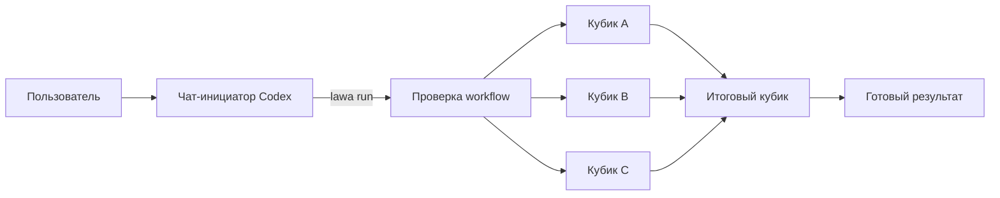

<p align="center">
  
</p>

<h1 align="center">Lawa</h1>

<p align="center">
  <strong>Workflow-оркестратор для параллельной работы AI-агентов в Codex.</strong><br>
  Опишите граф задач в JSON — Lawa запустит независимые ветки параллельно,
  дождётся зависимостей и сохранит состояние для безопасного продолжения.
</p>

<p align="center">
  
  
  
</p>

---

Lawa превращает большую задачу в управляемый поток отдельных задач Codex —
«кубиков». У каждого кубика есть собственный промпт, отдельный чат и явные
зависимости. Как и лава, работа свободно течёт по готовым веткам графа, а затем
собирается в общий результат.

## Зачем нужна Lawa

Один агент хорошо решает последовательную задачу. Но ревью, исследование,
рефакторинг или подготовка релиза часто состоят из независимых частей. Их можно
выполнить одновременно, а итоговый этап запустить только после готовности всех
входов.

Lawa берёт на себя механику такого процесса:

- проверяет JSON-схему, ссылки между кубиками и отсутствие циклов;
- запускает независимые кубики параллельно в отдельных задачах Codex App;
- передаёт каждому агенту общую постановку и его локальный промпт;
- ждёт успешного завершения всех зависимостей перед запуском следующего кубика;
- сохраняет связи с чатами, статусы и отдельную память агентов;
- продолжает тот же запуск после остановки, не создавая дубликаты задач;
- адресно прерывает активные turn при `Ctrl+C` или `SIGTERM`.

Lawa не заменяет Codex и не вызывает модель напрямую. Модель, инструменты,
авторизация и ограничения задаются в Codex. Lawa отвечает только за граф,
состояние и координацию выполнения.

## Как это работает



Чат-инициатор остаётся интерфейсом управления: в нём пользователь запускает
workflow, получает `runId`, следит за важными изменениями и продолжает остановленный
запуск. Каждый кубик выполняется в своей задаче Codex и остаётся видимым в приложении.

## Быстрый старт

### Требования

- Go 1.27.0 или новее;
- macOS или Linux;
- установленный и авторизованный Codex CLI, доступный как `codex` в `PATH`.

Живой сквозной сценарий подтверждён на macOS. Для Linux код и файловые блокировки
поддерживаются, но перед выпуском Linux-сборки нужна отдельная ручная проверка.

### Сборка

```sh
git clone https://github.com/stray-live-pixel/Lawa.git
cd Lawa
go build -o bin/lawa ./cmd/lawa
./bin/lawa help
```

Внешних Go-зависимостей у проекта нет. Версия Go закреплена в `go.mod`.

### Установка скилла в проект

Команда `skill` печатает готовый `SKILL.md`, но намеренно не выбирает место
установки за пользователя:

```sh
mkdir -p .agents/skills/lawa
./bin/lawa skill > .agents/skills/lawa/SKILL.md
```

После установки обновите список скиллов Codex. В этом репозитории проектный скилл
уже находится в `.agents/skills/lawa`.

## Запуск из Codex App

Основной сценарий не требует вручную собирать длинную CLI-команду:

1. Сформулируйте задачу в отдельном чате Codex.
2. Вызовите установленный скилл `lawa` и укажите файл workflow. В интерфейсе это
   может отображаться как `$lawa` или `/lawa`.
3. Агент проверит JSON, сохранит постановку задачи и запустит Lawa в рабочей папке.
4. Оставайтесь в чате-инициаторе: он сообщит `runId`, статусы и необходимость
   ручного вмешательства.

Пример запроса:

```text
$lawa examples/review-by-criteria.json
Проверь приложение целиком на текущем HEAD. Не учитывай generated-файлы и зависимости.
```

Для каждого готового кубика Lawa создаст отдельную задачу Codex. Модель для этих
задач не зашита в Lawa: используется конфигурация Codex, действующая в окружении
запуска.

## Формат workflow

Workflow — один JSON-объект с непустым `id` и массивом `steps`. У каждого кубика
обязательны четыре поля:

| Поле | Назначение |
| --- | --- |
| `id` | Уникальный ID кубика внутри workflow |
| `type` | Сейчас поддерживается только значение `agent` |
| `prompt` | Самостоятельная инструкция агенту |
| `dependsOn` | ID кубиков, успеха которых нужно дождаться |

Пустой `dependsOn` разрешает немедленный запуск. Порядок элементов в `steps` не
управляет исполнением — его задают только зависимости.

```json
{
  "id": "code-review",
  "steps": [
    {
      "id": "architecture",
      "type": "agent",
      "prompt": "Проведи архитектурное ревью и сохрани доказательные выводы.",
      "dependsOn": []
    },
    {
      "id": "security",
      "type": "agent",
      "prompt": "Проверь границы доверия и обработку чувствительных данных.",
      "dependsOn": []
    },
    {
      "id": "summary",
      "type": "agent",
      "prompt": "Собери общий Markdown-отчёт и расставь приоритеты.",
      "dependsOn": ["architecture", "security"]
    }
  ]
}
```

Проверить файл без запуска Codex:

```sh
./bin/lawa validate workflow.json
```

Валидация отклоняет неизвестные поля, повторные ключи, неверные типы, пустые
обязательные значения, несуществующие и повторные зависимости, а также прямые и
косвенные циклы. Файл должен содержать ровно один JSON-объект.

Готовые примеры:

- [`examples/review.json`](examples/review.json) — компактное ревью с параллельными ветками;
- [`examples/review-by-criteria.json`](examples/review-by-criteria.json) — подробное ревью по 12 критериям;
- [`examples/integration-smoke.json`](examples/integration-smoke.json) — сквозная проверка интеграции.

## CLI

```text
lawa run <workflow.json> --cwd <проект> \
  (--task <текст> | --task-file <путь>) \
  --initiator-thread-id <id>

lawa resume <run-id>
lawa validate <workflow.json>
lawa skill
lawa help
```

Для многострочной постановки и текста со специальными символами используйте
`--task-file` и `--comment-file`: содержимое файлов не интерпретируется оболочкой.
Полный список параметров всегда доступен через `lawa help`.

| Код выхода | Значение |
| ---: | --- |
| `0` | Все кубики успешно завершены |
| `2` | Ошибка входных данных, состояния или интеграции |
| `130` | Остановка через `SIGINT` |
| `143` | Остановка через `SIGTERM` |

### Статус в чате-инициаторе

Во время `run` и `resume` Lawa печатает полный Markdown-снимок при каждом изменении
и не реже одного раза в минуту. Строки идут в порядке `meta.json`; каждый кубик
показывается как `<id> — <state>`. Если `codexThreadId` уже известен, ID ведёт в
его задачу по ссылке `codex://threads/<id>`. Пустой ID не подменяется чатом-
инициатором и получает пометку «чат ещё не создан». Ссылка
`vscode://file/<абсолютная-папка-run>` открывает именно текущий запуск.

Тот же снимок создаёт `workflow-status.puml` и `workflow-status.png` в папке run.
PNG рендерится локальной командой `plantuml -pipe`; способ установки и требования
Java/Graphviz зависят от ОС и описаны в
[документации PlantUML](https://plantuml.com/command-line). Ошибка renderer не
останавливает workflow: текст остаётся актуальным, source сохраняется, а старый
PNG удаляется, чтобы его нельзя было принять за новую схему.

## Состояние и продолжение

Каждый запуск сохраняется в `~/.light-ai-workflows/<run-id>/`:

```text
<run-id>/
├── workflow.json          # неизменяемый снимок графа
├── task.md                # постановка и комментарий пользователя
├── meta.json              # статусы и связи с чатами Codex
├── workflow-status.puml   # последний PlantUML source статуса
├── workflow-status.png    # картинка того же снимка, если renderer доступен
└── memory/
    └── <thread-id>.md     # отдельная память каждого кубика
```

Метаданные обновляются атомарно, а один run блокируется от одновременного управления
двумя процессами. Намерение создать чат сохраняется до сетевого запроса — это не
даёт незаметно запустить один кубик дважды после сбоя.

```sh
./bin/lawa resume <run-id>
```

`resume` открывает тот же run, сверяет сохранённые чаты и запускает только новые
готовые кубики. Если последний turn был прерван, Lawa отправляет один `continue` в
тот же чат. Упавший кубик пользователь продолжает вручную; успешно завершённый не
перезапускается.

Только успешный статус кубика открывает его зависимости. Ошибка, отмена или ожидание
подтверждения не останавливают независимые ветки, но зависимые кубики продолжат ждать.

## Безопасность и границы ответственности

- Lawa сохраняет стандартные sandbox-ограничения и managed restrictions Codex.
- Кубики работают с `approvalPolicy: on-request` и встроенной автопроверкой запросов
  прав; Lawa не подтверждает повышение прав самостоятельно.
- Системные файлы run доступны агентам только для чтения. Каждый агент может менять
  только собственный файл памяти, но читать память зависимых коллег.
- Общие рабочие файлы проекта не защищены от логических конфликтов между параллельными
  агентами. Если одному кубику нужен результат другого, задайте это через `dependsOn`.
- Lawa не оценивает смысл ответа агента и не проверяет созданные им артефакты: успех
  определяется терминальным статусом задачи Codex.
- Собственного лимита параллельности и таймаута нет; действуют ограничения Codex и
  окружения пользователя.

## Разработка

```sh
go test -race -count=1 ./...
go vet ./...
go mod tidy -diff
```

Основные модули:

```text
cmd/lawa/             CLI, сигналы, preflight и встроенный SKILL.md
internal/workflow/    строгий разбор и проверка JSON-графа
internal/scheduler/   расчёт готовых и ожидающих кубиков
internal/coordinator/ запуск волн, наблюдение и восстановление
internal/codex/       клиент Codex App Server
internal/runstore/    атомарное хранение и блокировка run
internal/statusreport/ ссылки, текстовый статус и PlantUML-артефакты
```

## Документация

- [Продуктовые требования MVP](product/1.md)
- [План и состояние реализации](docs/mvp-roadmap.md)
- [Проверка интеграции с Codex App](docs/codex-integration.md)
- [Последнее комплексное ревью](docs/review.md)
- [Инструкция встроенного скилла](cmd/lawa/SKILL.md)

## Статус проекта

MVP реализован: доступны `validate`, `run`, `resume`, установка скилла, параллельные
ветки, зависимости, минутный статус с PlantUML, сохранение состояния, ручное
продолжение и адресное прерывание.
Интеграция проверена живыми пятикубиковыми сценариями на macOS с Codex Desktop.

Текущие ограничения и план развития зафиксированы в
[`docs/mvp-roadmap.md`](docs/mvp-roadmap.md). Воспроизводимые проблемы можно сообщать
через [GitHub Issues](https://github.com/stray-live-pixel/Lawa/issues).
