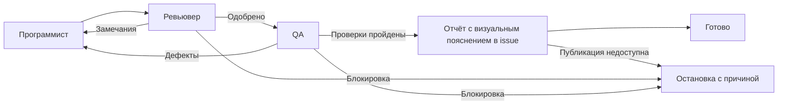

# Цикл разработки задачи

[development-cycle.json](development-cycle.json) — последовательный workflow Lawa v2
с тремя ролями. Постановка передаётся при запуске через `--task-file` или `--task`.



Программист меняет код и выполняет первичные проверки. Ревьювер сосредоточен
на технических сценариях и DX — удобстве разработчика: контрактах, обработке ошибок,
поддерживаемости, подключении, документации и диагностике.

QA проверяет продукт как чёрный ящик глазами конечного пользователя.
Сначала формулирует пользовательские истории: кто, чего хочет добиться и зачем.
Из них составляет тест-кейсы, затем выполняет их через публичный интерфейс.
Проверяет основной путь и проблемы, мешающие получить результат: например,
ошибочный ввод, непонятные действия, потерю данных и восстановление после ошибки.
Написание тестов и зелёные unit-тесты не заменяют эту проверку.

Каждый кейс содержит ID, связь с историей, цель, предусловия, данные, шаги,
ожидаемый и фактический результат, статус и доказательство. QA сохраняет кейсы
и результаты в своей памяти; неизвестные требования отмечает как предположения,
а неоднозначность, влияющую на приёмку, передаёт человеку.

После исправлений QA задача снова проходит ревью. Участники передают результаты
через память посещений Lawa. Все трое читают и используют скиллы `mom` и `concise`
для сообщений, памяти и отчётов: просто и кратко, с сохранением важных фактов.
Скиллы должны быть доступны в окружении Codex; общий шаблон `communication`
подключает это правило к каждому шагу.

Одобрение и возвраты выполняются через `choose_decision`, а не по тексту ответа.
QA запускается только по решению `approve`; успех всего workflow возможен только
по решению QA `passed` после публикации отчёта в issue. Технический сбой программиста передаётся ревьюверу через
`after`, чтобы тот зафиксировал блокировку, а не принял непроверенный результат.

Максимум пять посещений программиста: первая реализация и четыре доработки.
При исчерпании лимита или блокировке workflow завершается как `failed`.
В случае необходимости решения человека вопрос остаётся в отчёте; автоматического
ожидания ответа этот пример не реализует. Модель наследуется из настроек Codex.

GitHub issue хранит хронологию всех итераций. Каждый участник после каждого
посещения публикует отдельный комментарий: роль, runId/visitId, PR, SHA, выполненная
работа, проверки, вывод и следующий шаг. Возвраты и блокировки тоже попадают в issue.
Повторная отправка одного отчёта не создаёт дубль; новые итерации не стирают старые.

Программист после каждой итерации создаёт обычный коммит и пушит рабочую ветку,
создаёт или обновляет PR, затем объясняет в issue, что сделал и почему готов к ревью.
Незавершённые изменения сохраняются как честно описанная контрольная точка.
Если изменений нет, вместо пустого коммита указывается причина и прежний SHA.
Ревьювер публикует технический отчёт с основаниями одобрения или замечаниями.
QA публикует продуктовый отчёт и при успехе, и при дефектах; дефекты возвращают
задачу программисту после публикации отчёта.

Каждый отчёт QA содержит скриншоты или схему/диаграмму последовательности,
связанную с пользовательскими кейсами. При успехе объясняет, почему результат
готов к production в пределах требований; при дефектах показывает проблему,
при блокировке — где проверка остановилась. Если загрузка картинок недоступна,
используется Mermaid. Отчёты публикуются в issue, а не в PR.

В постановке укажи URL issue и, если есть, существующего PR. Иначе программист
создаст PR в отдельной рабочей ветке и передаст ссылку остальным. Ревьювер и QA
проверяют опубликованную версию; смена SHA требует новой проверки.
Недоступность GitHub или невозможность подтвердить публикацию отчёта блокируют
передачу: причина и черновик сохраняются в памяти. Правила:

- [Отчёт каждого участника](templates/development-cycle-iteration-report.md).
- [Коммит и передача программиста](templates/development-cycle-developer-delivery.md).
- [Продуктовый отчёт QA](templates/development-cycle-qa-report.md).

Commit, push и создание/обновление PR разрешены программисту. Ревьювер и QA код
не меняют. Merge и deploy не входят в цикл. Запускай в выделенной рабочей папке
без параллельных правок. Отчёты публикуют сами агенты; при аварийном завершении
процесса гарантировать комментарий этот workflow не может.

Проверка конфигурации из корня репозитория Lawa:

```sh
lawa validate examples/development-cycle.json
```

Пример команды запуска (замени пути на реальные):

```sh
lawa run /absolute/Lawa/examples/development-cycle.json \
  --cwd /absolute/project \
  --task-file /absolute/task.md
```

Это одна задача с внутренними возвратами, а не периодическая серия.
Для длительной работы запускай процесс под независимым супервизором:
завершение управляющей сессии Codex не должно останавливать workflow.
