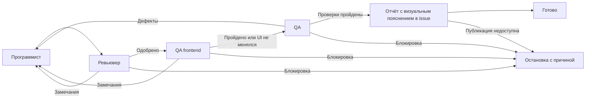

# Цикл разработки задачи

[development-cycle.json](development-cycle.json) — последовательный workflow Lawa v2
с четырьмя ролями. Постановка передаётся при запуске через `--task-file` или `--task`.



Программист меняет код и выполняет первичные проверки. Ревьювер сосредоточен
на технических сценариях и DX — удобстве разработчика: контрактах, обработке ошибок,
поддерживаемости, подключении, документации и диагностике.

При изменениях UI Lawa программист использует скилл `lawa-frontend` из
`~/.codex/skills/lawa-frontend/SKILL.md`. До UI-правок проверяет доступность
браузера и сохранение снимка в собственном окружении по общему шаблону qa_browser.
При недоступном браузере продолжает реализацию и технические проверки, передаёт
QA точную диагностику и непроверенные сценарии, не заявляя визуальную готовность.

`approve` ревьювера означает допуск к независимому QA, а не окончательную приёмку.
Отсутствие у программиста скриншотов из-за окружения или draft-статус PR сами
по себе не блокируют переход. Ревьювер проверяет код и технические доказательства:
реальные недоработки возвращает программисту, готовую к проверке реализацию
передаёт QA frontend. Отчёт QA frontend нельзя требовать до запуска этого шага.

QA frontend после ревью проверяет интерфейс по тому же скиллу: реальную компоновку
Gravity UI и удобство поиска, чтения, понимания и обработки текста. Проходит
пользовательский путь в браузере, оценивает достаточность информации, краткость
кнопок, раскрытия и сохранение контекста. Возвращает конкретные помехи программисту,
не исправляя код и не блокируя задачу ради вкуса. При отсутствии UI-изменений
сразу передаёт задачу финальному QA: без запуска приложения, браузера,
загрузки скилла, скриншотов и отчёта в issue; причина пропуска и SHA остаются в памяти. Недоступность скилла или необходимых
средств проверки при изменённом UI — блокировка. При UI-изменениях публикует собственный отчёт со скриншотами в issue и
передаёт сценарии, материалы и SHA финальному QA. Программист и оба QA получают
общие инструкции запуска браузера и сохранения снимков; правила публикации
изображений через gh получают оба QA. Сбой одного этапа
не требует повторять успешные этапы; недоступная проверка завершается блокировкой
с сохранением материалов и точной причины.

Финальный QA проверяет продукт как чёрный ящик глазами конечного пользователя.
Сначала формулирует пользовательские истории: кто, чего хочет добиться и зачем.
Из них составляет тест-кейсы, затем выполняет их через публичный интерфейс.
Проверяет основной путь и проблемы, мешающие получить результат: например,
ошибочный ввод, непонятные действия, потерю данных и восстановление после ошибки.
Написание тестов и зелёные unit-тесты не заменяют эту проверку.

Каждый кейс содержит ID, связь с историей, цель, предусловия, данные, шаги,
ожидаемый и фактический результат, статус и доказательство. QA сохраняет кейсы
и результаты в своей памяти; неизвестные требования отмечает как предположения,
а неоднозначность, влияющую на приёмку, передаёт человеку.

После замечаний любого QA задача возвращается программисту и снова проходит
ревью и QA frontend. Участники передают результаты
через память посещений Lawa. Все участники читают и используют скиллы `mom` и `concise`
для сообщений, памяти и отчётов: просто и кратко, с сохранением важных фактов.
Скиллы должны быть доступны в окружении Codex; общий шаблон `communication`
подключает это правило к каждому шагу.

Одобрение и возвраты выполняются через `choose_decision`, а не по тексту ответа.
QA frontend запускается по решению reviewer `approve`, финальный QA — только
по решению qa_frontend `passed`; успех всего workflow возможен только
по решению QA `passed` после публикации отчёта в issue. Технический сбой программиста передаётся ревьюверу через
`after`, чтобы тот зафиксировал блокировку, а не принял непроверенный результат.

Максимум пять посещений программиста: первая реализация и четыре доработки.
При исчерпании лимита или блокировке workflow завершается как `failed`.
В случае необходимости решения человека вопрос остаётся в отчёте; автоматического
ожидания ответа этот пример не реализует. Модель наследуется из настроек Codex.

GitHub issue хранит хронологию всех итераций. Каждый участник после каждого
посещения (кроме раннего пропуска QA frontend без frontend-изменений) публикует отдельный комментарий: роль, runId/visitId, PR, SHA, выполненная
работа, проверки, вывод и следующий шаг. Возвраты и блокировки тоже попадают в issue.
Повторная отправка одного отчёта не создаёт дубль; новые итерации не стирают старые.

Программист после каждой итерации создаёт обычный коммит и пушит рабочую ветку,
создаёт или обновляет PR, затем объясняет в issue, что сделал и почему готов к ревью.
Незавершённые изменения сохраняются как честно описанная контрольная точка.
Если изменений нет, вместо пустого коммита указывается причина и прежний SHA.
Ревьювер публикует технический отчёт с основаниями одобрения или замечаниями.
QA публикует продуктовый отчёт и при успехе, и при дефектах; дефекты возвращают
задачу программисту после публикации отчёта.

Каждый отчёт QA содержит скриншоты или схему/диаграмму последовательности,
связанную с пользовательскими кейсами. При успехе объясняет, почему результат
готов к production в пределах требований; при дефектах показывает проблему,
при блокировке — где проверка остановилась. Отчёты публикуются в issue, а не в PR.

Для PR с UI-изменениями обязательны реальные скриншоты всех изменившихся состояний
по полному PR. Для каждого изменения QA связывает состояние, кейс и скриншот,
объясняет ожидаемый и фактический результат и почему принимает изменение.
Предпочтительны красные рамки, аккуратные подписи и стрелки на копиях скриншотов;
оригиналы сохраняются, разметка не закрывает интерфейс. Без разметки нужны точные
пояснения рядом с нумерованными снимками. Невозможность показать изменённое состояние
блокирует приёмку. Mermaid заменяет картинки только для задач без UI-изменений.

Владелец разрешил публикацию изображений только в GitHub. Оба QA используют `gh api`
для загрузки оригиналов и копий с разметкой в отдельную ветку
`qa-artifacts/issue-<номер>-<runId>-<stepId>-<visitId>` репозитория задачи, затем встраивает
изображения по SHA коммита материалов в комментарий issue через `gh issue comment
--body-file`. Пошаговый контракт находится в общем шаблоне qa_images и входит в prompt обоих QA.
Браузерная авторизация и сторонние хостинги не нужны; повторное разрешение
не требуется. QA проверяет публикацию и доступ читателей, не меняет код или ветку
PR. Публикация картинок сама по себе не означает успешной приёмки.

В постановке укажи URL issue и, если есть, существующего PR. Иначе программист
создаст PR в отдельной рабочей ветке и передаст ссылку остальным. Ревьювер и оба QA
проверяют опубликованную версию; смена SHA требует новой проверки.
Недоступность GitHub или невозможность подтвердить публикацию отчёта блокируют
передачу: причина и черновик сохраняются в памяти. Правила:

- [Отчёт каждого участника](templates/development-cycle-iteration-report.md).
- [Коммит и передача программиста](templates/development-cycle-developer-delivery.md).
- [Браузер и скриншоты](templates/development-cycle-qa-browser.md).
- [Публикация изображений](templates/development-cycle-qa-images.md).
- [Продуктовый отчёт QA](templates/development-cycle-qa-report.md).

Commit, push и создание/обновление PR разрешены программисту. Ревьювер и оба QA код
не меняют; обоим QA отдельно разрешены коммиты материалов через GitHub API по правилам
выше. Merge и deploy не входят в цикл. Запускай в выделенной рабочей папке
без параллельных правок. Отчёты публикуют сами агенты; при аварийном завершении
процесса гарантировать комментарий этот workflow не может.

Проверка конфигурации из корня репозитория Lawa:

```sh
lawa validate examples/development-cycle.json
```

Пример команды запуска (замени пути на реальные):

```sh
lawa run /absolute/Lawa/examples/development-cycle.json \
  --cwd /absolute/project \
  --task-file /absolute/task.md
```

Это одна задача с внутренними возвратами, а не периодическая серия.
Для длительной работы запускай процесс под независимым супервизором:
завершение управляющей сессии Codex не должно останавливать workflow.

### Недоступный браузер и повторный запуск

Инструкция не предоставляет браузер автоматически. Каждый исполнитель проверяет
реальный доступ; при пустом списке браузеров проверяет разрешённую альтернативу
по qa_browser. QA не принимает UI по коду или тестам, если браузер так и недоступен:
сохраняет диагностику и завершает посещение через `blocked`.

Изменение workflow не меняет снимок уже запущенного исполнения. После терминального
`failed` нужен новый запуск с исправленным окружением и новым снимком workflow;
`resume` не переигрывает выбранный `blocked`. Передай существующие issue, PR, ветку
и оставшиеся проверки, чтобы сохранить выполненную работу. Новый запуск выполняется
по отдельному поручению, а не автоматически при правке этого файла.
