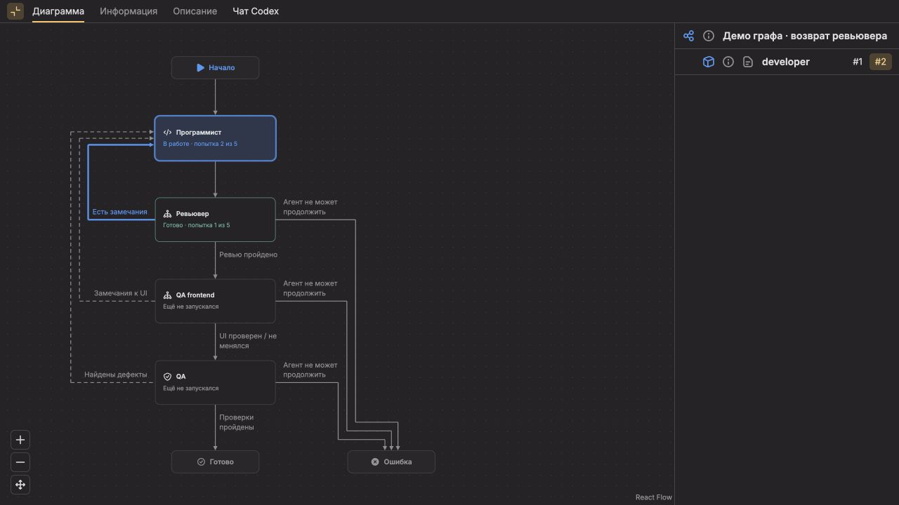
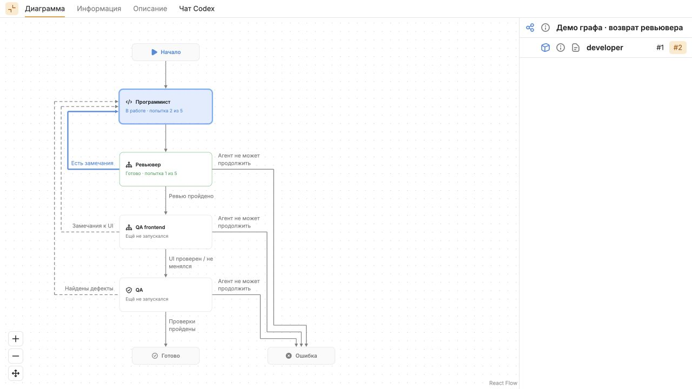
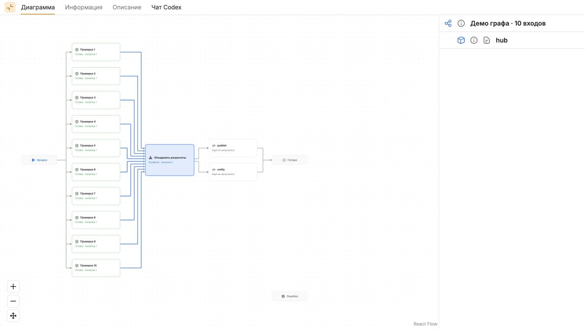
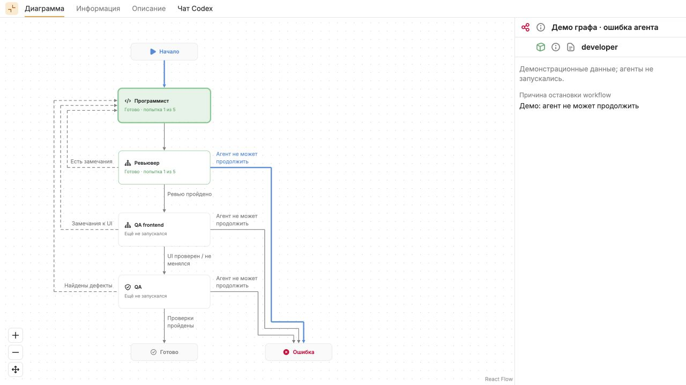
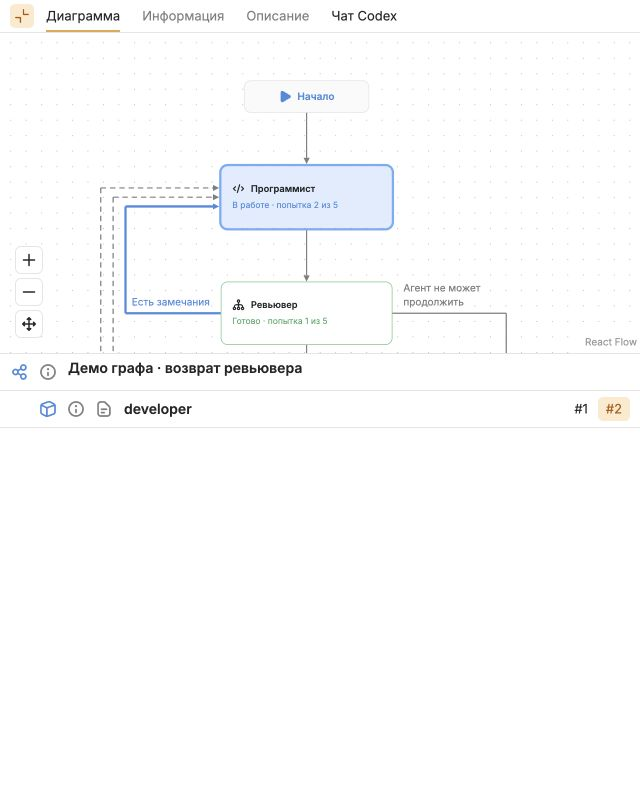

# Проверка графа #146

20 сентября 2026, браузер Codex IAB, production-сборка, 1280×720;
узкая компоновка — 640×800. Все данные вымышленные, без запуска агентов.

Воспроизведение: собрать UI по `ui/README.md`, запустить `lawa serve` с отдельным
временным `--root`, открыть `/preview?view=all` и выбрать «Демо графа».
Кнопка «Развернуть граф» скрывает дерево; контролы позволяют приблизить и вернуть
весь граф. В `/view` проверено определение `workflows/development-cycle/workflow.json`.

- «Возврат ревьювера»: программист выполняет попытку 2 из 5; синий только вход
  от ревьювера. Выбор посещения 1 меняет причину на старт, сохраняя координаты
  кубиков и камеру. Подписи без фона, кликов, tooltip и tabIndex.
- «10 входов»: все десять сохранённых источников join выделены, боковая грань
  выросла до 140 px. Два выхода используют общую вертикаль поворота.
  Также осмотрен веер из восьми выходов с высотой 116 px.
- «История без причин»: синих связей нет; отсутствие trigger не заменяется догадкой.
- «Успех», «Ошибка агента», «Лимит попыток», «Отмена»: зелёный финиш только
  при succeeded; failed и лимит красные; отмена оставляет оба исхода нейтральными.
- Светлая и тёмная темы, раскрытие графа, переключение истории, узкое окно:
  граф доступен через pan/zoom; на узком окне детали переходят под полотно.

Автоматические проверки дополняют осмотр: v1/v2, строгая валидация icon/label,
структурированный trigger, join, legacy без причин, геометрия development-cycle,
self-loop, веер, плотные входы, длинные переходы и трёхстрочное сокращение подписей.

